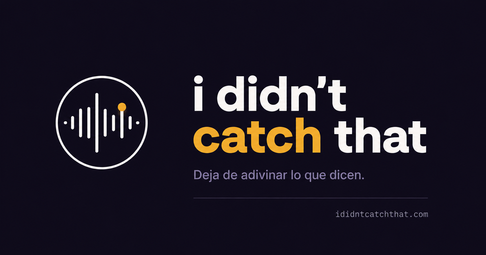

<p align="center">
  
</p>

<h1 align="center">ididntcatchthat.com</h1>

<p align="center">
  <strong>Aprende a entender y sonar como un nativo</strong><br/>
  Fonética real · Connected speech · Expresiones que no se enseñan en clase
</p>

<p align="center">
  <a href="https://ididntcatchthat.com"></a>
  &nbsp;
  <a href="https://dev.ididntcatchthat.com"></a>
</p>

<p align="center">
  
  
  
  
  
</p>

<p align="center">
  <a href="./docs/project-overview.md">📖 Documentación completa</a>
  &nbsp;·&nbsp;
  <a href="http://localhost:3001/docs">📋 Swagger (local)</a>
  &nbsp;·&nbsp;
  <a href="./docs/adr/">🏛️ ADRs</a>
</p>

---

## 📖 Descripción general

**ididntcatchthat.com** es una plataforma gamificada de aprendizaje de inglés centrada en cómo los nativos realmente hablan. Desarrollada como **Trabajo de Fin de Máster (TFM)**, ataca el problema de ese momento en el que un nativo habla y simplemente no entiendes nada.

A diferencia de apps mainstream que priorizan vocabulario y gramática, este proyecto se enfoca en tres áreas clave:

| | Área | Qué cubre |
|:-:|------|-----------|
| 🎙️ | **Fonética real** | Los 23 sonidos del inglés, con énfasis en los problemáticos para hispanohablantes |
| 🔗 | **Connected speech** | Cómo cambian los sonidos al conectar palabras (Flap T, linking, reduction…) |
| 💬 | **Expresiones nativas** | Vocabulario coloquial que realmente usan los nativos en conversación |

Cada expresión puede escucharse en **tres acentos** 🇺🇸 🇬🇧 🇦🇺 con audio de calidad generado por síntesis de voz profesional.

### 🌐 Demos desplegadas

| Entorno | URL | Descripción |
|:-------:|:---:|-------------|
| 🟢 **Prod** | [ididntcatchthat.com](https://ididntcatchthat.com) | TFM desplegado en entorno real |
| 🔵 **Dev** | [dev.ididntcatchthat.com](https://dev.ididntcatchthat.com) | Entorno de integración y pruebas |

---

## 🛠️ Stack tecnológico

### Frontend

<p>
  
  
  
  
  
  
  
</p>

### Backend

<p>
  
  
  
  
  
</p>

### Datos, CDN e infra

<p>
  
  
  
  
  
  
</p>

### Testing

<p>
  
  
  
  
  
</p>

### Observabilidad

<p>
  
  
  
  
</p>

### IA en el desarrollo

<p>
  
  
  
</p>

Orquestación del código con **Cursor** (agentes, skills del repo en `skills/` y `AGENTS.md`), apoyado por Claude y GitHub Copilot en scaffolding, tests, revisión y documentación.

### IA en el producto

<p>
  
  
  
</p>

- **DeepSeek** — genera **ejemplos bilingües** (EN/ES) y **notas fonéticas** (IPA, native speech) al crear o completar flashcards en backoffice.
- **ElevenLabs** — síntesis de voz en 3 acentos (offline, pipeline de audio → CDN).
- **Azure Speech** — evaluación de pronunciación en tiempo real (bonus de puntos).

---

## ⚡ Instalación y ejecución

### 📋 Requisitos previos

<p>
  
  
  
  
  
</p>

### 🚀 Arrancar el proyecto (desarrollo con Doppler)

Requiere acceso a Doppler y servicios externos (Aiven, R2, ElevenLabs…).

```bash
pnpm install
make dev          # RabbitMQ en Docker + API :3000 + Client :5173 (hot-reload)
# o por separado:
make dev-api      # terminal 1
make dev-client   # terminal 2
# o
make up           # Docker completo (:3001 / :4001), sin hot-reload
```

> **Nota:** `DATABASE_URL` apunta a Aiven (remoto). `AMQP_URI` en Doppler usa el host `rabbitmq` para contenedores; `make dev` lo reescribe a `localhost` y levanta Rabbit en Docker.

### 🎓 Evaluación local (sin Doppler ni servicios de pago)

Para clonar el repo y ejecutarlo **sin cuentas externas** (tribunal, profesor, evaluación):

```bash
pnpm install
make local-up      # env setup + stack completo en Docker (api, client, postgres, rabbitmq, minio)
make local-seed    # migraciones + usuario demo + flashcards
# o con hot-reload:
make local-dev     # env setup + infra en Docker + API :3000 + Client :5173 (host)
make local-seed
```

| Recurso | Docker (`make local-up`) | Host (`make local-dev`) |
|---------|--------------------------|--------------------------|
| Frontend | http://localhost:4001 | http://localhost:5173 |
| API | http://localhost:3000 | http://localhost:3000 |
| Swagger | http://localhost:3000/docs | http://localhost:3000/docs |
| MinIO console | http://localhost:9001 | http://localhost:9001 |
| Credenciales MinIO | `localminio` / `localminio` | `localminio` / `localminio` |
| Usuario demo | `demo@local.dev` / `DemoLocal123!` | `demo@local.dev` / `DemoLocal123!` |

**Limitaciones en local:** Google OAuth no funciona (usar email/password o modo guest). Audio de flashcards seed usa URLs de demo públicas; nuevos audios van a MinIO (S3 local). Demo completa desplegada: [ididntcatchthat.com](https://ididntcatchthat.com).

Guía extendida → [docs/local-development.md](./docs/local-development.md)

### 🖥️ Puertos por perfil

| Servicio | Local Docker (`make local-up`) | Local Dev (`make local-dev`) | Dev Doppler (`make up`) | Tests E2E |
|----------|--------------------------------|-------------------------------|--------------------------|-----------|
| Frontend | :4001 | :5173 (Vite) | :4001 | — |
| API | :3000 | :3000 | :3001 | :3000 |
| Postgres | :5434 | :5434 | Aiven (remoto) | :5433 |
| RabbitMQ | :5674 | :5674 | red interna Docker (VPS); `127.0.0.1:5672` solo `make dev` local | :5673 |
| MinIO | :9000 / :9001 | :9000 / :9001 | — (R2 prod) | — |

### ⌨️ Comandos útiles

| Comando | Descripción |
|---------|-------------|
| `pnpm lint` | ESLint en api + client |
| `pnpm test` | Unit tests en api + client |
| `pnpm test:e2e` | E2E tests en api + client |
| `pnpm test:all` | Unit + E2E en api + client |
| `make local-up` | Stack local completo en Docker (api, client, postgres, rabbitmq, minio) |
| `make local-dev` | Infra en Docker + API + Client en host (hot-reload, sin Doppler) |
| `make local-seed` | Migraciones + datos demo |
| `make dev` | RabbitMQ en Docker + API + Client hot-reload (Doppler) |
| `make up` | Stack dev completo en Docker (Doppler) |
| `make down` | Parar stack dev |
| `make vps-deploy-dev` | Deploy a VPS — entorno dev |
| `make vps-deploy-prod` | Deploy a VPS — entorno prod |
| `make security-audit` | [VPS] Auditoría de puertos, RabbitMQ y SSH |
| `make security-verify` | [VPS] Verificación post-deploy (sin leaks externos) |

---

## 🏗️ Estructuración del proyecto

Monorepo con separación clara entre frontend y backend, organizado por **bounded contexts** en el backend y **pods** en el cliente.

```
ididntcatchthat/
├── apps/
│   ├── api/              ← 🟢 Backend NestJS (Clean Architecture + DDD)
│   │   └── src/
│   │       ├── content/      ← 📚 Flashcards, módulos, pipeline de audio
│   │       ├── gaming/       ← 🎮 Partidas, intentos, mecánica de juego
│   │       ├── identity/     ← 🔐 Auth JWT, OAuth Google, sesiones, guests
│   │       └── progress/     ← 📈 Estadísticas, streaks, ranking
│   └── client/           ← 🔵 Frontend React (Pods + Container/Presentational)
│       └── src/
│           ├── containers/   ← Pods por dominio (gaming, flashcards…)
│           ├── core/         ← Router, auth, API client, providers
│           ├── common/       ← Componentes UI reutilizables
│           └── views/        ← Páginas que componen layout + pods
├── docs/                 ← 📖 Documentación, ADRs, specs y diagramas Mermaid
├── infra/                ← 📊 Docker Compose files + configs de Prometheus, Grafana, Loki, nginx
├── skills/               ← 🤖 AI agent skills (instrucciones para agentes IA)
├── .github/              ← ⚙️ GitHub Actions (CI/CD)
├── Makefile              ← 🛠️ Comandos de desarrollo y despliegue
└── README.md
```

### 🧱 Arquitectura backend

Organización por **Screaming Architecture** con capas Clean Architecture en cada bounded context:

```
{context}/{aggregate}/
├── domain/           ← Entidades, value objects, reglas de negocio
├── application/      ← Casos de uso, domain services, subscribers
└── infrastructure/   ← Controllers, TypeORM, adaptadores externos
```

---

## ✨ Funcionalidades

<table>
<tr>
<td width="50%" valign="top">

### 🃏 Aprendizaje con flashcards

- Unidad básica: la **flashcard** (expresión, fonema o construcción)
- **Auto-evaluación** al estilo Anki
- **Vista de detalle** con significado, ejemplos y notas fonéticas
- **Audio en 3 acentos** servido desde CDN

### 📚 Módulos de contenido

| Módulo | Foco |
|--------|------|
| 🎵 Native Sounds | 23 fonemas del inglés |
| 🔗 Connecting Words | Linking, reduction, Flap T… |
| ✨ Beautifying Sentences | Conectores y fluidez |
| 🗣️ Sounding Native | Expresiones coloquiales |

</td>
<td width="50%" valign="top">

### 🎮 Gaming y gamificación

- Modos **juego** y **estudio**
- Partidas de 10 / 20 / 50 flashcards
- **Streaks**, accuracy, ranking y logros
- **Bonus de pronunciación** con Azure Speech

### 🔐 Auth y acceso

- Email/password + **OAuth Google**
- Modo **guest** sin registro
- Migración guest → usuario registrado
- Roles: guest, user, teacher, admin

### 🎧 Backoffice y audio

- Panel de administración de flashcards
- Pipeline **DeepSeek** (ejemplos + fonética) + **ElevenLabs** (×3 voces)
- CDN para reproducción de baja latencia

</td>
</tr>
</table>

### 📊 Observabilidad

<p>
  
  
  
</p>

---

## 🎓 Cumplimiento de los objetivos del máster

Este TFM demuestra las competencias trabajadas a lo largo del máster, con evidencia concreta en el repositorio y en las demos desplegadas.

<p align="center">
  
  
  
  
  
  
  
</p>

<details open>
<summary><strong>🔍 Análisis</strong></summary>
<br/>

- **Problema real identificado**: la brecha entre el inglés de clase y el inglés hablado por nativos
- **Propuesta de valor diferenciada** → [project-overview](./docs/project-overview.md)
- **Modelo de dominio** previo a implementar → [domain-model](./docs/domain/domain-model.md) · [game-mechanics](./docs/domain/game-mechanics.md) · [auth-guest](./docs/domain/auth-guest.md)
- **28 ADRs** con contexto, alternativas y consecuencias → [docs/adr/](./docs/adr/)

</details>

<details>
<summary><strong>📐 Diseño</strong></summary>
<br/>

- **Clean Architecture + DDD** con bounded contexts: `content`, `gaming`, `identity`, `progress`
- **Frontend por pods** Container/Presentational → [frontend-architecture](./docs/engineering/frontend-architecture.md)
- **Diagramas Mermaid** embebidos en la documentación
- **OpenAPI/Swagger** + validación dual Class Validator + Zod
- **Entornos** local / dev / prod → [deployment](./docs/deployment.md)

</details>

<details>
<summary><strong>⚙️ Implementación</strong></summary>
<br/>

- Monorepo **TypeScript end-to-end** (`apps/api` + `apps/client`)
- Casos de uso explícitos + repositorios como interfaces en domain
- **Domain Events** y Event Bus entre bounded contexts
- Pipeline **DeepSeek** (contenido) + **ElevenLabs** (audio) → CDN + Azure Speech en tiempo real
- **CI/CD** GitHub Actions + Docker + Makefile + VPS
- Desplegado en [ididntcatchthat.com](https://ididntcatchthat.com) y [dev.ididntcatchthat.com](https://dev.ididntcatchthat.com)

</details>

<details>
<summary><strong>✅ Buenas prácticas</strong></summary>
<br/>

- Conventional Commits + Husky (lint-staged, commitlint)
- ESLint + Prettier + TypeScript estricto
- **TDD** Red → Green → Refactor para features nuevas
- Skills de agentes IA en `skills/`
- Container (datos) vs Component (UI pura)
- Inyección de dependencias con tokens Symbol

</details>

<details>
<summary><strong>🧪 Testing</strong></summary>
<br/>

```
        ▲
       /E\     E2E (Playwright) — flujos de juego, auth, navegación
      /───\
     / Int \   Integration — repos, APIs externas, módulos NestJS
    /───────\
   /  Unit   \ Unit — dominio, casos de uso, hooks, componentes
  /───────────\
```

- Backend: Jest + jest-mock-extended + Object Mothers
- Frontend: Vitest + RTL + MSW
- Coverage cliente: **80 %** branches / functions / lines / statements
- CI ejecuta tests en cada PR

</details>

<details>
<summary><strong>🔒 Seguridad</strong></summary>
<br/>

<p>
  
  
  
  
  
</p>

- Cookies httpOnly para refresh tokens
- Tokens guest en memoria (no localStorage)
- Validación de inputs en backend y cliente
- Guards, voters y `@CurrentUser` por rol

</details>

<details>
<summary><strong>🤖 LLMs e IA</strong></summary>
<br/>

| Ámbito | Uso |
|--------|-----|
| 🛠️ **Desarrollo** | **Cursor** (IDE + agentes), skills en `skills/`/`AGENTS.md`, Claude y Copilot |
| 📚 **Producto (contenido)** | **DeepSeek** — ejemplos bilingües y fonética (IPA, native speech) al crear flashcards |
| 🎙️ **Producto (audio)** | ElevenLabs al crear flashcards (offline, ×3 acentos) |
| 🗣️ **Producto (voz)** | Azure Speech en tiempo real (bonus de puntos) |
| 📝 **Metodología** | Skills reutilizables en `skills/`, decisiones en `docs/adr/` |

> La IA no actúa en el flujo principal del juego: el contenido es **curado** en backoffice (DeepSeek + ElevenLabs), no generado dinámicamente durante la partida.

</details>

---

## 🎓 Entrega TFM

Material de evaluación del Trabajo de Fin de Máster (MoureDev).

| Recurso | Enlace |
|---------|--------|
| Repositorio | [github.com/AbrahamVilchesDeLaCruz/ididntcatchthat](https://github.com/AbrahamVilchesDeLaCruz/ididntcatchthat) |
| Despliegue (prod) | [ididntcatchthat.com](https://ididntcatchthat.com) |
| Despliegue (dev) | [dev.ididntcatchthat.com](https://dev.ididntcatchthat.com) |
| Presentación (slides) | [Preview online](https://htmlpreview.github.io/?https://github.com/AbrahamVilchesDeLaCruz/ididntcatchthat/blob/dev/docs/presentation/tfm-slides.html) · [código fuente](./docs/presentation/tfm-slides.html) |
| Vídeo explicativo | [YouTube](https://youtu.be/I0Ciebm0Yb0) · [Preview embebida](./docs/presentation/tfm-video.html) |

### Presentación TFM

Presentación web interactiva (15 slides) alineada con el dark mode de la app. Ideal para defensa del TFM en pantalla completa.

> **GitHub no ejecuta HTML del repo** — al abrir el archivo en GitHub solo verás el código fuente. Usa uno de estos enlaces para la **preview interactiva**:

| Modo | Enlace |
|------|--------|
| **Preview online** (recomendado) | [htmlpreview.github.io → presentación TFM](https://htmlpreview.github.io/?https://github.com/AbrahamVilchesDeLaCruz/ididntcatchthat/blob/dev/docs/presentation/tfm-slides.html) |
| **Alternativa** | [raw.githack.com → presentación TFM](https://raw.githack.com/AbrahamVilchesDeLaCruz/ididntcatchthat/dev/docs/presentation/tfm-slides.html) |
| **Código fuente** | [docs/presentation/tfm-slides.html](./docs/presentation/tfm-slides.html) |

Tras clonar el repositorio, también puedes abrirla en el navegador:

```bash
open docs/presentation/tfm-slides.html   # macOS
# xdg-open docs/presentation/tfm-slides.html   # Linux
```

Controles: `←` `→` o `Espacio` para avanzar · `F` pantalla completa · `1`–`9` saltar a slide · `#slide-N` en la URL.

### Vídeo TFM

Vídeo con captura de pantalla y explicación del proyecto. Alojado en YouTube; la página del repo embebe el reproductor con el mismo dark mode que la app.

| Modo | Enlace |
|------|--------|
| **YouTube** (formulario de entrega) | [youtu.be/I0Ciebm0Yb0](https://youtu.be/I0Ciebm0Yb0) |
| **Preview embebida** | [raw.githack.com → vídeo TFM](https://raw.githack.com/AbrahamVilchesDeLaCruz/ididntcatchthat/dev/docs/presentation/tfm-video.html) |
| **Código fuente** | [docs/presentation/tfm-video.html](./docs/presentation/tfm-video.html) |

Tras clonar el repositorio:

```bash
open docs/presentation/tfm-video.html   # macOS
# xdg-open docs/presentation/tfm-video.html   # Linux
```

### Acceso a la aplicación

#### Producción — explorar el producto desplegado

En [ididntcatchthat.com](https://ididntcatchthat.com) puedes probar el flujo completo de usuario **sin registro** con el **modo invitado** (botón en la landing): juego, estudio, progreso, ranking y logros.

> Las credenciales de cuenta con rol administrador en producción **no se publican en este repositorio** para evitar uso indebido del backoffice (creación de flashcards dispara APIs de pago: DeepSeek y ElevenLabs). Se facilitan **solo en el formulario de entrega del TFM** al tribunal.

#### Local — evaluación completa sin cuentas externas

Para revisar **backoffice, panel de administración y arquitectura end-to-end** sin coste de APIs ni Doppler:

```bash
pnpm install
make local-up
make local-seed
```

| Recurso | URL / credenciales |
|---------|-------------------|
| Frontend | http://localhost:4001 |
| API + Swagger | http://localhost:3000 · http://localhost:3000/docs |
| Email | `demo@local.dev` |
| Contraseña | `DemoLocal123!` |
| Rol | `admin` (acceso completo a backoffice y métricas) |

Guía extendida → [docs/local-development.md](./docs/local-development.md)

---

## 📚 Documentación adicional

| | Recurso | Descripción |
|:-:|---------|-------------|
| 📖 | [Project Overview](./docs/project-overview.md) | Qué es, por qué existe, decisiones de producto |
| 🏛️ | [ADRs](./docs/adr/) | Architecture Decision Records |
| 📊 | [Observability](./docs/observability.md) | Prometheus, Grafana y Loki |
| 📈 | [Grafana Guide](./docs/grafana.md) | PromQL, LogQL y alertas |
| 🚀 | [Deployment](./docs/deployment.md) | Env vars, secrets, deploy al VPS |
| 📋 | [Swagger](http://localhost:3001/docs) | Contrato de API (local/dev) |

---

<p align="center">
  
  <br/><br/>
  <em>El foco no es solo que funcione — es que esté <strong>bien construido</strong> y <strong>bien razonado</strong>.</em>
</p>
