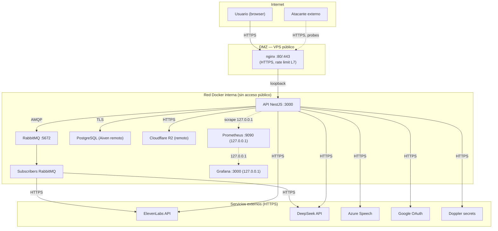

# ADR 033 — Modelo de amenaza y postura de seguridad

**Estado**: Aceptado
**Fecha**: 2026-07-15
**Autores**: equipo ididntcatchthat

---

## Contexto

La plataforma maneja datos personales (email, nickname, opcionalmente OAuth Google) y datos de juego (progreso, rachas, ránking). El audio y contenido se sirven desde CDNs externos. Las claves API (DeepSeek, ElevenLabs, Cloudflare R2, Azure, Google OAuth) viven en Doppler y llegan a los contenedores vía `doppler run`.

El ADR-018 cubre la estrategia de autenticación (JWT + refresh en cookie httpOnly) pero **no documenta las amenazas explícitas que mitigamos** ni el diagrama de confianza — preguntas esperables en la defensa del TFM ante un tribunal.

Este ADR cierra esa laguna: amenazas (STRIDE), mitigaciones implementadas, riesgos residuales aceptados y límite de confianza.

---

## Decisión

Documentar la postura de seguridad como **modelo STRIDE explícito** con mitigaciones mapeadas a cada categoría y una lista honesta de lo que **no** está mitigado todavía.

### Diagrama de confianza

**Límite de confianza principal:** el usuario y el atacante externo están fuera; nginx es el único punto de entrada público. Los contenedores del backend escuchan en `127.0.0.1` en VPS (ADR-030) — la red Docker es interna y nunca se expone.

---

## Amenazas STRIDE y mitigaciones

### S — Spoofing (suplantación de identidad)

| Amenaza | Mitigación | Estado |
|---|---|---|
| Suplantar a un usuario registrado | JWT firmado con `JWT_SECRET` (≥32 chars, validado por Joi — ver [`env.validation.ts`](../../apps/api/src/shared/infrastructure/config/env.validation.ts) línea 21). El payload incluye `userId` que **no** se toma del body ni de headers — solo del token validado. | ✅ |
| Robar el access token | Access token vive **en memoria JS**, nunca en `localStorage`. Refresh token en cookie `httpOnly + Secure + SameSite=Strict`. | ✅ |
| Reutilizar un refresh token robado | Refresh tokens se almacenan en DB (`refresh_tokens` table) con `revoked_at`. Logout → `revoked_at = now()`. Rotación de refresh tokens: cada `POST /auth/refresh` invalida el anterior. | ✅ |
| Suplantar al backend frente al usuario | HTTPS con Certbot + Let's Encrypt (ver [deployment.md](../deployment.md)). HSTS lo activa nginx. | ✅ |
| Suplantar al backend frente a RabbitMQ | AMQP con SASL (`guest:guest` reemplazado por credenciales Doppler en compose). | ✅ |

### T — Tampering (modificación de datos)

| Amenaza | Mitigación | Estado |
|---|---|---|
| Modificar el body de un request | `ValidationPipe` global con `whitelist + forbidNonWhitelisted + transform` ([`main.ts`](../../apps/api/src/main.ts) líneas 36–43). DTOs con `class-validator`. Status 422 para errores de validación. | ✅ |
| Inyectar JSON malicioso en campos libres | Zod en el cliente para validar respuestas de API; `class-validator` rechaza payloads no esperados con 422. | ✅ |
| Modificar el contenido de una flashcard desde fuera | Endpoints `PATCH /flashcards/:id` requieren rol `teacher` o `admin` (`RolesGuard`). | ✅ |
| Modificar la URL de audio de un flashcard | Solo admins pueden editar URLs de audio en backoffice (campo protegido). | ✅ |

### R — Repudiation (negación de acciones)

| Amenaza | Mitigación | Estado |
|---|---|---|
| "Yo no creé esa flashcard" | Logs estructurados (Pino) con `userId`, `flashcardId`, `action`. Se busca en Grafana/Loki por `userId` + ventana temporal. | ✅ |
| "Yo no inicié ese juego" | Cada `GameStarter.execute()` loguea `userId` + `gameId`. Métrica `app_games_started_total` (sin labels de usuario — Prometheus no guarda PII). | ⚠️ Parcial — los IDs en logs son seudónimos pero sin PII directa |
| "No hice ese login con Google" | El evento `FlashcardCreated` no es PII, pero los logs de auth sí lo son — redacción planeada (ver Riesgos residuales). | ⚠️ |

### I — Information Disclosure (filtración de información)

| Amenaza | Mitigación | Estado |
|---|---|---|
| Filtrar la lista de usuarios (ranking, búsqueda) | Endpoint `/ranking` solo expone `nickname` + `current_streak` + `longest_streak` — nunca email, `userId` interno ni OAuth provider. | ✅ |
| Filtrar respuestas de error con stack traces | `HttpExceptionFilter` global mapea `DomainException` a códigos limpios (404, 422, 409) sin stack. Solo `InternalServerErrorException` se loguea internamente con stack completo. | ✅ |
| Filtrar secretos vía logs | `Logger` interface no acepta blobs. Secrets nunca se loguean. Doppler no aparece en logs de aplicación. | ✅ |
| Filtrar audio seed de un tenant a otro | Cloudflare R2 usa un único bucket público — no hay multi-tenancy en esta versión. Si se aíslan tenants, se necesitan policies de bucket por tenant. | N/A hoy |
| SSRF a servicios internos | El backend solo llama a URLs hardcodeadas (`api.deepseek.com`, `api.elevenlabs.io`, `*.r2.cloudflarestorage.com`). No se construye ninguna URL a partir de input de usuario. | ✅ |

### D — Denial of Service

| Amenaza | Mitigación | Estado |
|---|---|---|
| Brute force sobre `/auth/login` o `/auth/register` | `ThrottlerGuard` global con dos políticas ([`app.module.ts`](../../apps/api/src/app.module.ts) líneas 40–52): 100 req/min global, 10 req/min en endpoints `auth`. | ✅ |
| Llenar la DB con registros fake | Misma throttling + CAPTCHA planeado (ver Riesgos residuales). | ⚠️ Parcial |
| Saturar el bucket de R2 con audio generado | Generación de audio está en backoffice (solo teacher/admin). Límite de concurrencia ElevenLabs configurable (`ELEVENLABS_MAX_CONCURRENT=3`). | ✅ |
| Saturar RabbitMQ con eventos | RabbitMQ con `prefetch` configurado en el consumer. Backpressure natural si los subscribers no tiran. | ✅ |
| Saturar la DB con queries pesadas (ranking, progress) | Índices en `games(user_id, completed_at)` y `flashcards(category, audio_status)`. Métricas de latencia HTTP en Grafana para detectar regresiones. | ✅ |

### E — Elevation of Privilege

| Amenaza | Mitigación | Estado |
|---|---|---|
| Guest accede a endpoints de user registrado | `@UseGuards(JwtAuthGuard)` rechaza el token tipo `guest`. El `UserContext.type` se valida en cada handler. | ✅ |
| User accede a endpoints de admin | `@UseGuards(JwtAuthGuard, RolesGuard) @Roles('admin')`. Doble check: el guard valida el token, el rol se lee del payload firmado. | ✅ |
| Bypass de `@Roles` manipulando el token | El payload `roles` viene del JWT firmado — no del body. Imposible falsificar sin `JWT_SECRET`. | ✅ |
| Acceder a flashcards de otro teacher | `RolesGuard` + verificación de ownership en el use case (`flashcard.ownerId === request.userId` para teachers; admin pasa siempre). | ✅ |

---

## OWASP Top 10 — cobertura

| Riesgo | Mitigación principal |
|---|---|
| A01 Broken Access Control | Guards (`JwtAuthGuard`, `RolesGuard`, `GuestAuthGuard`, `AnyAuthGuard`) + verificación de ownership en use cases |
| A02 Cryptographic Failures | HTTPS (Certbot + Let's Encrypt), JWT firmado (HS256 con secret ≥32 chars), bcrypt para passwords |
| A03 Injection | `class-validator` rechaza payloads inválidos, TypeORM usa queries parametrizadas, **no SQL crudo** en código de aplicación |
| A04 Insecure Design | ADRs documentan decisiones, Clean Architecture + DDD, tests E2E para flujos críticos |
| A05 Security Misconfiguration | UFW solo 22/80/443 ([vps-security.md](../vps-security.md)), binding `127.0.0.1` (ADR-030), Swagger solo fuera de prod ([`main.ts`](../../apps/api/src/main.ts) línea 47), `forbidNonWhitelisted` en ValidationPipe |
| A06 Vulnerable Components | Trivy en CI (ADR-029), overrides de `pnpm` para CVEs en transitivas, `pnpm audit` en CI |
| A07 Identification & Auth Failures | JWT con refresh rotation, fail2ban en SSH, rate limit en `/auth/*` |
| A08 Software & Data Integrity | Doppler para secrets (nunca `.env` en repo), submodule integrity via `git pull` con tags, Docker images con digest pin |
| A09 Logging Failures | Pino + Loki + Grafana (ADR-020), logs estructurados JSON con contexto, métricas HTTP con `MetricsInterceptor` |
| A10 SSRF | Sin construcción de URLs desde input. Servicios externos hardcodeados. |

---

## Mitigaciones que **no** están implementadas

Esto es honestidad — lo que aún no tenemos:

| Mitigación | Estado | Plan |
|---|---|---|
| **Helmet** (headers HTTP de seguridad: CSP, HSTS, X-Frame-Options) | ❌ No instalado. nginx en el host ya setea `X-Frame-Options: SAMEORIGIN` y HSTS a nivel de reverse proxy. Falta CSP. | Pendiente — ver Riesgos residuales |
| **CAPTCHA en formularios públicos** (`/auth/register`, `/auth/guest`) | ❌ El rate limit mitiga parcialmente, pero un atacante distribuido puede bypasearlo. | Pendiente post-TFM |
| **WAF (Web Application Firewall)** | ❌ nginx en modo reverse proxy básico, sin reglas OWASP ModSecurity. | Pendiente post-TFM |
| **Audit log de acciones administrativas** | ❌ Solo logs de aplicación, sin tabla `admin_audit` queryable. | Pendiente post-TFM |
| **Anomaly detection** (login desde IP nueva, velocidad inusual) | ❌ No implementado. | Pendiente post-TFM |
| **Rotación automática de `JWT_SECRET`** | ❌ Rotación manual vía Doppler. | Manual hoy; automatizar post-TFM |
| **MFA en roles `admin` y `teacher`** | ❌ Solo password / OAuth Google. | Pendiente post-TFM |
| **Redaction de PII en logs** | ❌ `userId` se loguea en claro (UUID, no PII directa) pero `email` aparece en logs de auth en algunos paths. | Pendiente post-TFM |

---

## Riesgos residuales aceptados

Riesgos que el equipo conoce y acepta explícitamente durante el alcance del TFM:

1. **CSP ausente** — si un atacante consigue XSS (que requeriría primero bypasear el output encoding de React + el rate limit), no hay CSP que lo contenga. Mitigado por: React escapa por defecto, no usamos `dangerouslySetInnerHTML`, no hay innerHTML de strings de usuario.
2. **Sin CAPTCHA** — un atacante con suficientes IPs puede registrar miles de cuentas. Mitigado por: el `user` recién registrado sin actividad de juego no accede a endpoints caros; el rate limit por IP + `deviceId` reduce la ventana.
3. **JWT de 15min sin revocation list inmediata** — si un access token se filtra, es válido durante 15min. No hay endpoint para invalidar access tokens antes de su expiración. Mitigado por: el refresh token se puede revocar manualmente (logout + tabla `refresh_tokens`).
4. **Logs pueden contener `email` o `nickname`** en paths de auth — aceptable en producción porque Loki no es público (solo `127.0.0.1` + SSH tunnel — [ADR-020](./020-observability-strategy.md)).
5. **Dependencia de Doppler** — si Doppler cae, los contenedores no pueden arrancar. Mitigación: Doppler tiene SLA 99.9% y los secrets críticos también están disponibles manualmente en un password manager del equipo para disaster recovery.
6. **Sin sandboxing de tenants** — todos los usuarios comparten el mismo bucket de R2, la misma DB, el mismo RabbitMQ. Aceptable para el alcance del TFM (un único producto). Multi-tenancy requeriría rediseñar el modelo de storage.

---

## Confianza en proveedores externos

| Proveedor | Confiamos en... | Riesgo |
|---|---|---|
| Cloudflare R2 | Almacenamiento at-rest, HTTPS, sin egress fees | Caída del servicio → audio no se sirve |
| ElevenLabs | API key, TOS del proveedor | Caída → flashcards quedan con `audio_status = pending/failed` (pipeline manual) |
| DeepSeek | API key, TOS del proveedor | Caída → teacher no puede generar borradores (creación manual sigue posible) |
| Azure Speech | API key, región configurada | Caída → bonus de pronunciación no funciona (no implementado aún — [feature-flags-and-stubs.md](../engineering/feature-flags-and-stubs.md)) |
| Google OAuth | OAuth2 estándar, dominio verificado | Caída → usuarios no pueden hacer login con Google (email/password sigue funcionando) |
| Doppler | Secret management con SLA | Caída → deploys fallan |
| Aiven PostgreSQL | TLS, backups gestionados | Caída → API devuelve 500 en endpoints que tocan DB |

En todos los casos: la caída del proveedor degrada, **no compromete** la plataforma — los datos no se filtran por una caída externa.

---

## Consecuencias

**Positivas:**

- Amenazas y mitigaciones documentadas explícitamente — base para评审 del TFM y para auditorías futuras.
- La tabla de "lo que no está implementado" es un roadmap claro para hardening post-TFM.
- El diagrama de confianza sirve para explicar onboarding a nuevos contribuidores.

**Negativas / trade-offs:**

- El modelo STRIDE requiere mantenimiento: cada nuevo endpoint o integración debería revisarse contra esta tabla.
- Algunos riesgos residuales (CAPTCHA, MFA, CSP) son deuda explícita — no se debe ocultar en la defensa del TFM.

---

## Referencias

- [ADR-005](./005-cloudflare-cdn.md) — R2 / CDN
- [ADR-009](./009-elevenlabs.md) — generación de audio
- [ADR-018](./018-auth-strategy.md) — JWT + refresh tokens
- [ADR-020](./020-observability-strategy.md) — logs y métricas
- [ADR-029](./029-trivy-vulnerability-scanning.md) — CVE scanning
- [ADR-030](./030-docker-port-binding-policy.md) — binding 127.0.0.1
- [vps-security.md](../vps-security.md) — firewall, fail2ban, UFW
- [STRIDE (Microsoft)](https://learn.microsoft.com/en-us/azure/security/develop/threat-modeling-tool-threats)
- [OWASP Top 10](https://owasp.org/Top10/)
- Skill de implementación auth: [skills/api-auth](../../skills/api-auth/SKILL.md)