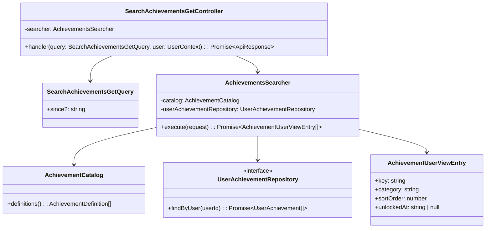

# Find Achievements — Diagrama de Clases

```mermaid
classDiagram
    class SearchAchievementsGetController {
        -searcher: AchievementsSearcher
        +handler(query: SearchAchievementsGetQuery, user: UserContext): Promise~ApiResponse~
    }

    class SearchAchievementsGetQuery {
        +since?: string
    }

    class AchievementsSearcher {
        -catalog: AchievementCatalog
        -userAchievementRepository: UserAchievementRepository
        +execute(request): Promise~AchievementUserViewEntry[]~
    }

    class AchievementCatalog {
        +definitions(): AchievementDefinition[]
    }

    class AchievementUserViewEntry {
        +key: string
        +category: string
        +sortOrder: number
        +unlockedAt: string | null
    }

    class UserAchievementRepository {
        <<interface>>
        +findByUser(userId): Promise~UserAchievement[]~
    }

    SearchAchievementsGetController --> AchievementsSearcher
    SearchAchievementsGetController --> SearchAchievementsGetQuery
    AchievementsSearcher --> AchievementCatalog
    AchievementsSearcher --> UserAchievementRepository
    AchievementsSearcher --> AchievementUserViewEntry
```

Copy i18n (title/description) vive en el cliente — API solo devuelve keys + metadata.
