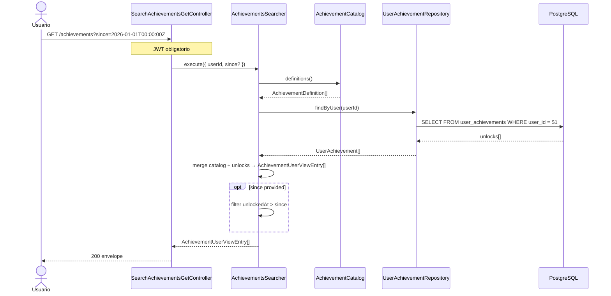

# Find Achievements — Diagrama de Secuencia

## Reglas

| Regla | Detalle |
|-------|---------|
| Catálogo | 14 logros v2 — fuente `AchievementCatalog` |
| `since` | ISO8601 opcional — filtra solo desbloqueos recientes |
| Orden | `sortOrder` del catálogo |
| Sin unlock | `unlockedAt: null` |
