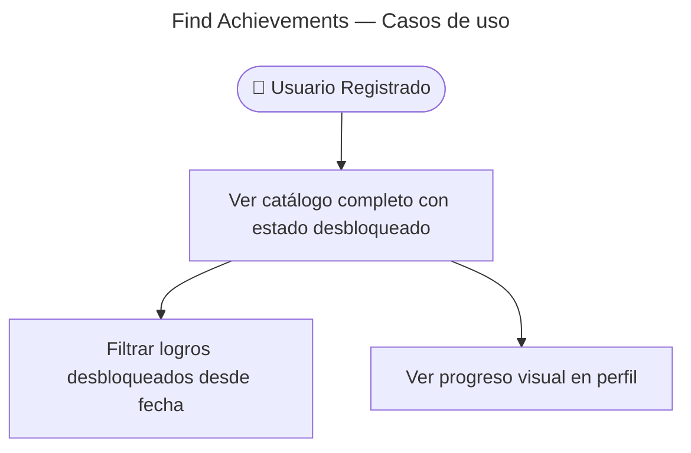

# Find Achievements — Casos de Uso

## Reglas de negocio

| Regla | Detalle |
|-------|---------|
| Auth | JWT obligatorio |
| Respuesta | `{ key, category, sortOrder, unlockedAt }[]` |
| i18n | Títulos/descripciones en cliente (`achievements.i18n`) |
| Paridad | Keys alineadas con seed DB (`achievement-catalog-parity.spec.ts`) |
| Envelope | `{ data: AchievementUserViewEntry[] }` |
