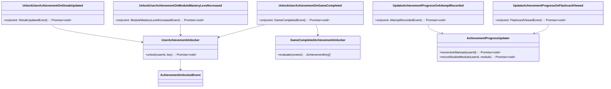

# Unlock Subscribers — Diagrama de Clases

```mermaid
classDiagram
    class UnlockUserAchievementOnGameCompleted {
        +on(event: GameCompletedEvent): Promise~void~
    }

    class UnlockUserAchievementOnStreakUpdated {
        +on(event: StreakUpdatedEvent): Promise~void~
    }

    class UnlockUserAchievementOnModuleMasteryLevelIncreased {
        +on(event: ModuleMasteryLevelIncreasedEvent): Promise~void~
    }

    class UpdateAchievementProgressOnAttemptRecorded {
        +on(event: AttemptRecordedEvent): Promise~void~
    }

    class UpdateAchievementProgressOnFlashcardViewed {
        +on(event: FlashcardViewedEvent): Promise~void~
    }

    class UserAchievementUnlocker {
        +unlock(userId, key): Promise~void~
    }

    class AchievementProgressUpdater {
        +incrementAttempts(userId): Promise~void~
        +recordStudiedModule(userId, module): Promise~void~
    }

    class GameCompletedAchievementUnlocker {
        +evaluate(context): AchievementKey[]
    }

    UnlockUserAchievementOnGameCompleted --> UserAchievementUnlocker
    UnlockUserAchievementOnGameCompleted --> GameCompletedAchievementUnlocker
    UnlockUserAchievementOnStreakUpdated --> UserAchievementUnlocker
    UnlockUserAchievementOnModuleMasteryLevelIncreased --> UserAchievementUnlocker
    UpdateAchievementProgressOnAttemptRecorded --> AchievementProgressUpdater
    UpdateAchievementProgressOnFlashcardViewed --> AchievementProgressUpdater
    UserAchievementUnlocker --> AchievementUnlockedEvent
```

Subscribers en `user-achievement/application/unlock/` y `progress/application/update/`.
