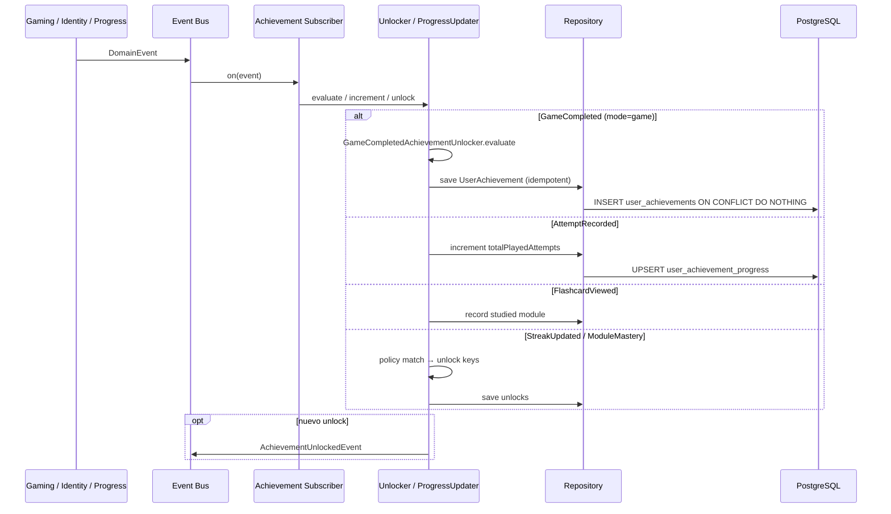

# Unlock Subscribers — Diagrama de Secuencia

## Por evento

| Evento | Handler | Logros / efecto |
|--------|---------|-----------------|
| `GameCompleted` (game) | `UnlockUserAchievementOnGameCompleted` | first_game, weak_warrior, perfect_session_10, cards_100, games_10, module_all_touched |
| `GameCompleted` (study) | mismo handler | study_first, study_sessions_10 |
| `AttemptRecorded` | `UpdateAchievementProgressOnAttemptRecorded` | Progreso cards_100 |
| `FlashcardViewed` | `UpdateAchievementProgressOnFlashcardViewed` | Progreso module_all_touched |
| `StreakUpdated` | `UnlockUserAchievementOnStreakUpdated` | streak_7, streak_30, streak_100 |
| `ModuleMasteryLevelIncreased` | `UnlockUserAchievementOnModuleMasteryLevelIncreased` | module_mastery_2, module_mastery_3 |
