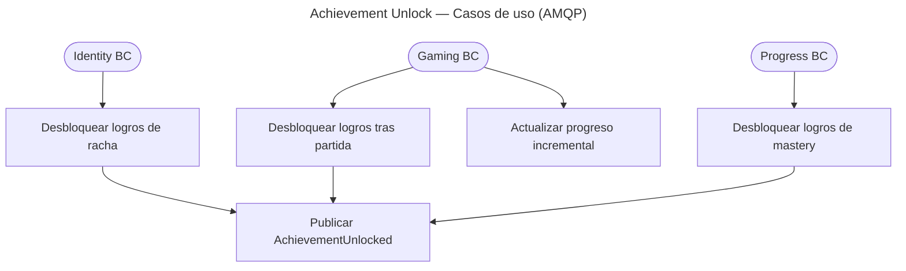

# Unlock Subscribers — Casos de Uso

## Reglas de negocio

| Regla | Detalle |
|-------|---------|
| Idempotencia | PK `(user_id, achievement_key)` — unlock duplicado no falla |
| Progreso | `user_achievement_progress` para contadores antes del unlock |
| Políticas | `AchievementUnlockPolicy` por tipo de evento en `catalog/domain/` |
| Evento | `AchievementUnlocked` publicado solo en unlock nuevo |
| Inbox | `processed_events` para handlers AMQP |

## Colas AMQP

| Handler | Cola |
|---------|------|
| `UnlockUserAchievementOnGameCompleted` | `achievement.unlock_achievement_on_game_completed` |
| `UpdateAchievementProgressOnAttemptRecorded` | `achievement.update_progress_on_attempt_recorded` |
| `UpdateAchievementProgressOnFlashcardViewed` | `achievement.update_progress_on_flashcard_viewed` |
| `UnlockUserAchievementOnStreakUpdated` | `achievement.unlock_achievement_on_streak_updated` |
| `UnlockUserAchievementOnModuleMasteryLevelIncreased` | `achievement.unlock_achievement_on_module_mastery_level_increased` |
