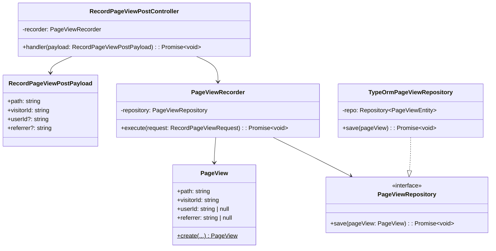

# Record Page View — Diagrama de Clases

```mermaid
classDiagram
    class RecordPageViewPostController {
        -recorder: PageViewRecorder
        +handler(payload: RecordPageViewPostPayload): Promise~void~
    }

    class RecordPageViewPostPayload {
        +path: string
        +visitorId: string
        +userId?: string
        +referrer?: string
    }

    class PageViewRecorder {
        -repository: PageViewRepository
        +execute(request: RecordPageViewRequest): Promise~void~
    }

    class PageView {
        +path: string
        +visitorId: string
        +userId: string | null
        +referrer: string | null
        +create(...)$ PageView
    }

    class PageViewRepository {
        <<interface>>
        +save(pageView: PageView): Promise~void~
    }

    class TypeOrmPageViewRepository {
        -repo: Repository~PageViewEntity~
        +save(pageView): Promise~void~
    }

    RecordPageViewPostController --> PageViewRecorder
    RecordPageViewPostController --> RecordPageViewPostPayload
    PageViewRecorder --> PageViewRepository
    PageViewRecorder --> PageView
    TypeOrmPageViewRepository ..|> PageViewRepository
```
