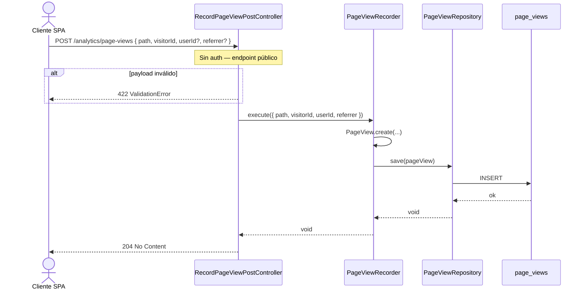

# Record Page View — Diagrama de Secuencia

```mermaid
sequenceDiagram
    actor SPA as Cliente SPA
    participant C as RecordPageViewPostController
    participant UC as PageViewRecorder
    participant R as PageViewRepository
    participant DB as page_views

    SPA->>C: POST /analytics/page-views { path, visitorId, userId?, referrer? }
    Note over C: Sin auth — endpoint público

    alt payload inválido
        C-->>SPA: 422 ValidationError
    end

    C->>UC: execute({ path, visitorId, userId, referrer })
    UC->>UC: PageView.create(...)
    UC->>R: save(pageView)
    R->>DB: INSERT
    DB-->>R: ok
    R-->>UC: void
    UC-->>C: void
    C-->>SPA: 204 No Content
```

## Cliente

`usePageView()` en `AppRouter` — fire-and-forget en cada cambio de ruta.
