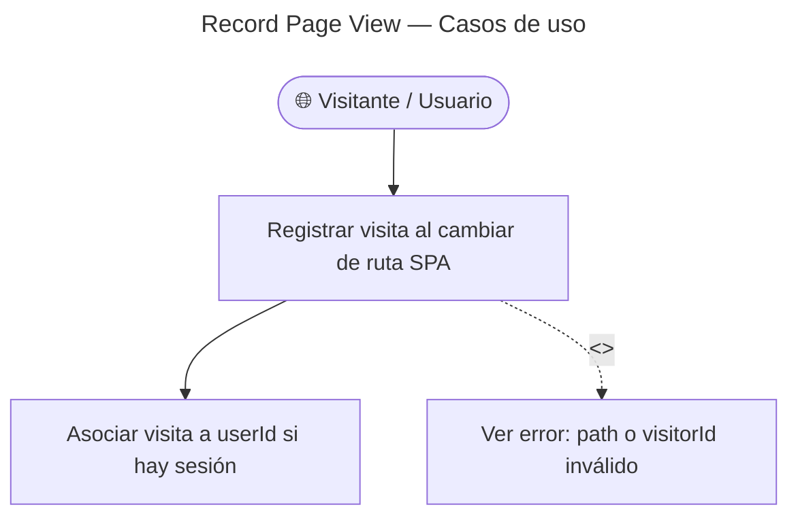

# Record Page View — Casos de Uso

## Reglas de negocio

| Regla | Detalle |
|-------|---------|
| Auth | Ninguna — endpoint público |
| Respuesta | 204 void (command, sin envelope) |
| `visitorId` | UUID anónimo persistente en localStorage |
| `userId` | Opcional — null si guest o no logueado |
| Persistencia | Append-only en `page_views` |
| Silencioso | Errores no bloquean navegación en cliente |
