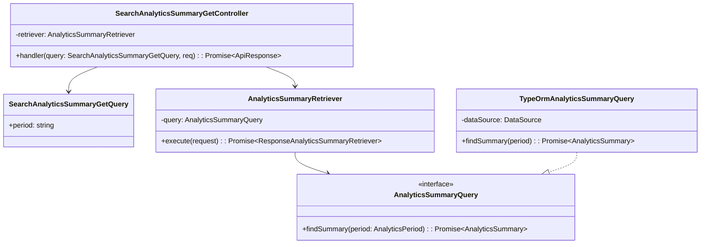

# Search Analytics Summary — Diagrama de Clases

```mermaid
classDiagram
    class SearchAnalyticsSummaryGetController {
        -retriever: AnalyticsSummaryRetriever
        +handler(query: SearchAnalyticsSummaryGetQuery, req): Promise~ApiResponse~
    }

    class SearchAnalyticsSummaryGetQuery {
        +period: string
    }

    class AnalyticsSummaryRetriever {
        -query: AnalyticsSummaryQuery
        +execute(request): Promise~ResponseAnalyticsSummaryRetriever~
    }

    class AnalyticsSummaryQuery {
        <<interface>>
        +findSummary(period: AnalyticsPeriod): Promise~AnalyticsSummary~
    }

    class TypeOrmAnalyticsSummaryQuery {
        -dataSource: DataSource
        +findSummary(period): Promise~AnalyticsSummary~
    }

    SearchAnalyticsSummaryGetController --> AnalyticsSummaryRetriever
    SearchAnalyticsSummaryGetController --> SearchAnalyticsSummaryGetQuery
    AnalyticsSummaryRetriever --> AnalyticsSummaryQuery
    TypeOrmAnalyticsSummaryQuery ..|> AnalyticsSummaryQuery
```

Cross-BC: la query agrega también tablas `games`, `users`, `flashcards` vía SQL raw.
