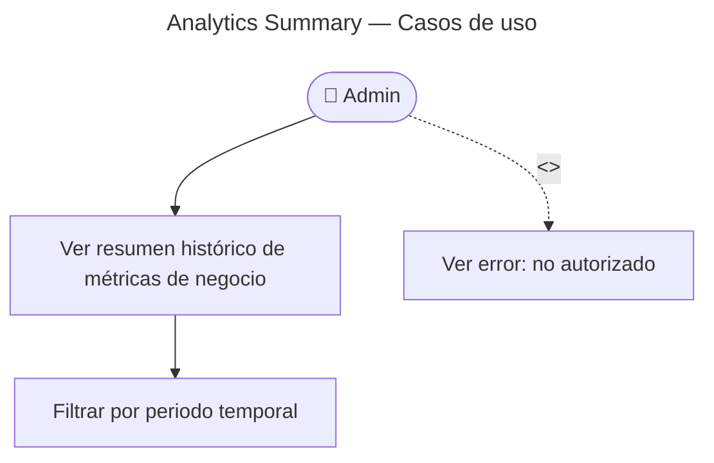

# Search Analytics Summary — Casos de Uso

## Reglas de negocio

| Regla | Detalle |
|-------|---------|
| Auth | JWT admin |
| Datos | Page views + contadores cross-BC (games, users, flashcards) |
| Histórico | Persistido en DB — sobrevive reinicios (vs Prometheus) |
| Envelope | `{ data: AnalyticsSummary, meta }` |
| Cliente | Tab Visitas/Contenido en backoffice observability |

## vs Observability

| | Analytics summary | Metrics summary |
|--|-------------------|-----------------|
| Fuente | PostgreSQL | Prometheus registry |
| Histórico | Sí | Desde arranque del proceso |
| Page views | Sí | No |
