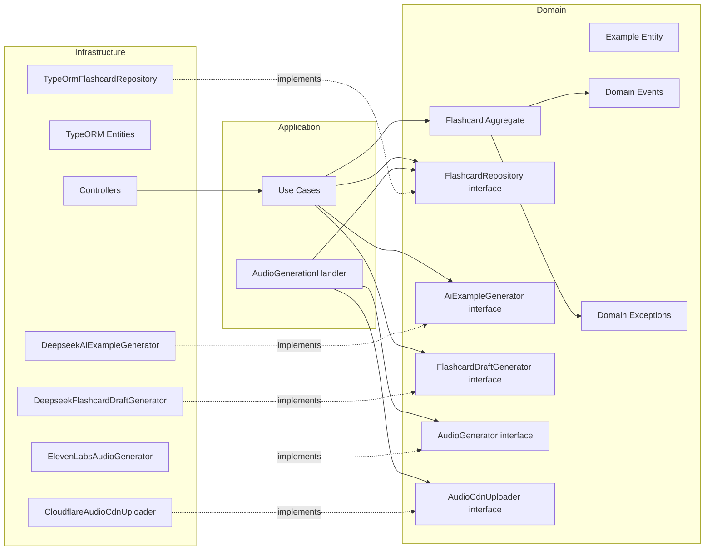

# Content BC — Documentación

> Bounded Context responsable del catálogo de flashcards y el pipeline de generación de audio en ididntcatchthat.

## Flujos de negocio

Cada flujo tiene 3 diagramas: secuencia, clases y casos de uso.

| Flujo                                   | Descripción                                    | Diagramas                                                                                                                              |
| --------------------------------------- | ---------------------------------------------- | -------------------------------------------------------------------------------------------------------------------------------------- |
| [Create](./create/)                     | Crear flashcard individual (formulario)        | [Secuencia](./create/sequence.md) · [Clases](./create/classes.md) · [Casos de uso](./create/usecases.md)                               |
| [Bulk Create](./bulk-create/)           | Crear múltiples flashcards en un solo request  | [Secuencia](./bulk-create/sequence.md) · [Clases](./bulk-create/classes.md) · [Casos de uso](./bulk-create/usecases.md)                |
| [Generate Flashcards](./generate-flashcards/) | Generar borradores con IA (backoffice)   | [Secuencia](./generate-flashcards/sequence.md) · [Clases](./generate-flashcards/classes.md) · [Casos de uso](./generate-flashcards/usecases.md) |
| [Update](./update/)                     | Editar flashcard existente                     | [Secuencia](./update/sequence.md) · [Clases](./update/classes.md) · [Casos de uso](./update/usecases.md)                               |
| [Search](./search/)                     | Listar y filtrar flashcards                    | [Secuencia](./search/sequence.md) · [Clases](./search/classes.md) · [Casos de uso](./search/usecases.md)                               |
| [Suggest Examples](./suggest-examples/) | Generar ejemplos de uso con IA                 | [Secuencia](./suggest-examples/sequence.md) · [Clases](./suggest-examples/classes.md) · [Casos de uso](./suggest-examples/usecases.md) |
| [Audio Pipeline](./audio-pipeline/)     | Generación asíncrona de audio post-publicación | [Secuencia](./audio-pipeline/sequence.md) · [Clases](./audio-pipeline/classes.md) · [Casos de uso](./audio-pipeline/usecases.md)       |

---

## Mapa de endpoints

| Método | Ruta                     | Flujo                                   | Auth                   |
| ------ | ------------------------ | --------------------------------------- | ---------------------- |
| `POST` | `/flashcards`            | [Create](./create/)                     | Bearer (teacher/admin) |
| `POST` | `/flashcards/bulk`       | [Bulk Create](./bulk-create/)           | Bearer (teacher/admin) |
| `POST` | `/ai/generate-flashcards`| [Generate Flashcards](./generate-flashcards/) | Bearer (teacher/admin) |
| `PUT`  | `/flashcards/:id`        | [Update](./update/)                     | Bearer (teacher/admin) |
| `GET`  | `/flashcards/:id`        | [Search](./search/)                     | Bearer (any)           |
| `GET`  | `/flashcards`            | [Search](./search/)                     | Bearer (any)           |
| `POST` | `/ai/suggest-examples`   | [Suggest Examples](./suggest-examples/) | Bearer (teacher/admin) |
| `GET`  | `/catalogs/categories`   | [Catalogs](./catalogs/)                 | Público                |

---

## Arquitectura general

---

## Domain Events publicados al bus

| Evento                  | Exchange                         | Consumer                                                               |
| ----------------------- | -------------------------------- | ---------------------------------------------------------------------- |
| `FlashcardCreatedEvent` | `idct.content.flashcard.created` | `AudioGenerationHandler` (interno)                                     |
| `FlashcardUpdatedEvent` | `idct.content.flashcard.updated` | `AudioGenerationHandler` (interno, solo si cambia expression/examples) |

> Ambos eventos son **auto-consumidos** por el propio BC Content. Ningún otro BC los consume directamente.

---

## Referencias

- [Taxonomía de contenido](../../../domain/content-taxonomy.md)
- [Spec de Content](../../../spec/content.md)
- [Tasks](../../../tasks/content.md)
- [Domain Model](../../../domain/domain-model.md)
- [Content & Backoffice](../../../domain/content-backoffice.md)
