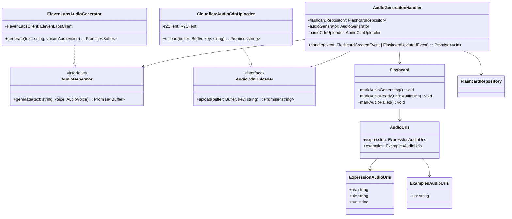

# Audio Pipeline — Diagrama de Clases

```mermaid
classDiagram
    class AudioGenerationHandler {
        -flashcardRepository: FlashcardRepository
        -audioGenerator: AudioGenerator
        -audioCdnUploader: AudioCdnUploader
        +handle(event: FlashcardCreatedEvent | FlashcardUpdatedEvent): Promise~void~
    }

    class AudioGenerator {
        <<interface>>
        +generate(text: string, voice: AudioVoice): Promise~Buffer~
    }

    class AudioCdnUploader {
        <<interface>>
        +upload(buffer: Buffer, key: string): Promise~string~
    }

    class ElevenLabsAudioGenerator {
        -elevenLabsClient: ElevenLabsClient
        +generate(text: string, voice: AudioVoice): Promise~Buffer~
    }

    class CloudflareAudioCdnUploader {
        -r2Client: R2Client
        +upload(buffer: Buffer, key: string): Promise~string~
    }

    class AudioUrls {
        +expression: ExpressionAudioUrls
        +examples: ExamplesAudioUrls
    }

    class ExpressionAudioUrls {
        +us: string
        +uk: string
        +au: string
    }

    class ExamplesAudioUrls {
        +us: string
    }

    class Flashcard {
        +markAudioGenerating() void
        +markAudioReady(urls: AudioUrls) void
        +markAudioFailed() void
    }

    AudioGenerationHandler --> AudioGenerator
    AudioGenerationHandler --> AudioCdnUploader
    AudioGenerationHandler --> FlashcardRepository
    AudioGenerationHandler --> Flashcard
    ElevenLabsAudioGenerator ..|> AudioGenerator
    CloudflareAudioCdnUploader ..|> AudioCdnUploader
    Flashcard --> AudioUrls
    AudioUrls --> ExpressionAudioUrls
    AudioUrls --> ExamplesAudioUrls
```
