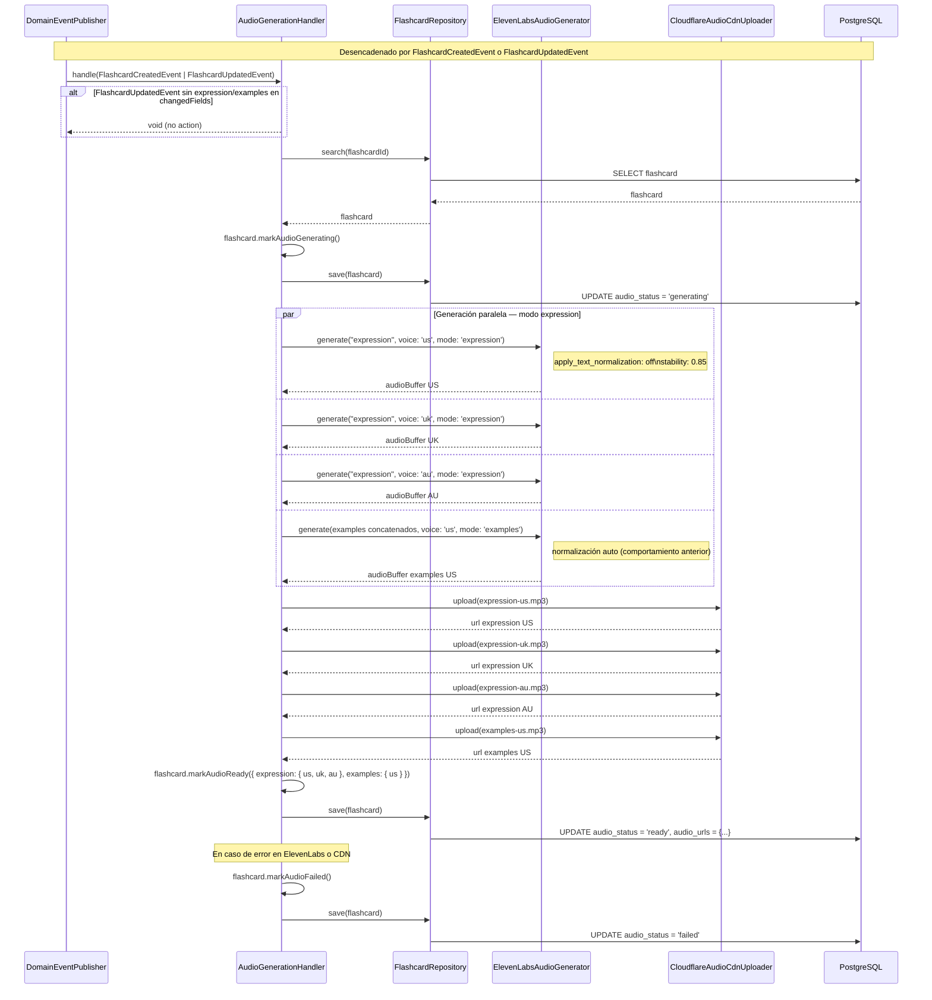

# Audio Pipeline — Diagrama de Secuencia

```mermaid
sequenceDiagram
    participant EP as DomainEventPublisher
    participant AH as AudioGenerationHandler
    participant FR as FlashcardRepository
    participant EL as ElevenLabsAudioGenerator
    participant CDN as CloudflareAudioCdnUploader
    participant DB as PostgreSQL

    note over EP,DB: Desencadenado por FlashcardCreatedEvent o FlashcardUpdatedEvent

    EP->>AH: handle(FlashcardCreatedEvent | FlashcardUpdatedEvent)

    alt FlashcardUpdatedEvent sin expression/examples en changedFields
        AH-->>EP: void (no action)
    end

    AH->>FR: search(flashcardId)
    FR->>DB: SELECT flashcard
    DB-->>FR: flashcard
    FR-->>AH: flashcard

    AH->>AH: flashcard.markAudioGenerating()
    AH->>FR: save(flashcard)
    FR->>DB: UPDATE audio_status = 'generating'

    par Generación paralela — modo expression
        AH->>EL: generate("expression", voice: 'us', mode: 'expression')
        note right of EL: apply_text_normalization: off\nstability: 0.85
        EL-->>AH: audioBuffer US
    and
        AH->>EL: generate("expression", voice: 'uk', mode: 'expression')
        EL-->>AH: audioBuffer UK
    and
        AH->>EL: generate("expression", voice: 'au', mode: 'expression')
        EL-->>AH: audioBuffer AU
    and
        AH->>EL: generate(examples concatenados, voice: 'us', mode: 'examples')
        note right of EL: normalización auto (comportamiento anterior)
        EL-->>AH: audioBuffer examples US
    end

    AH->>CDN: upload(expression-us.mp3)
    CDN-->>AH: url expression US
    AH->>CDN: upload(expression-uk.mp3)
    CDN-->>AH: url expression UK
    AH->>CDN: upload(expression-au.mp3)
    CDN-->>AH: url expression AU
    AH->>CDN: upload(examples-us.mp3)
    CDN-->>AH: url examples US

    AH->>AH: flashcard.markAudioReady({ expression: { us, uk, au }, examples: { us } })
    AH->>FR: save(flashcard)
    FR->>DB: UPDATE audio_status = 'ready', audio_urls = {...}

    note over AH: En caso de error en ElevenLabs o CDN
    AH->>AH: flashcard.markAudioFailed()
    AH->>FR: save(flashcard)
    FR->>DB: UPDATE audio_status = 'failed'
```
