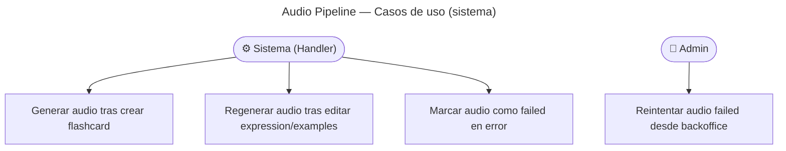

# Audio Pipeline — Casos de Uso

## Reglas de negocio

| Regla | Acción |
| ----- | ------ |
| 4 archivos de audio por flashcard: expression ×3 (US, UK, AU) + examples ×1 (US) | Generados en paralelo |
| El audio se genera de forma **asíncrona** (no bloquea la creación) | Disparado por eventos tras enrich/create |
| Si cambia `expression` o `examples` en una edición → regenerar | Handlers de eventos de dominio |
| Si cambia solo `meaning`, `ipa`, `nativeSpeech` → NO regenerar | Los handlers de audio ignoran el cambio |
| La flashcard es visible mientras el audio está pendiente | `audioStatus`: `pending` \| `generating` → skeleton en cliente |
| Error en ElevenLabs o CDN → `audioStatus: failed` | Log + métrica `app_audio_errors_total` |
| Retry manual admin | `POST /v1/flashcards/:id/regenerate-audio` solo si `failed` — ver [regenerate-audio](../regenerate-audio/usecases.md) |
| Troubleshooting 401 / keys | [troubleshooting/audio-generation.md](../../../../troubleshooting/audio-generation.md) |
