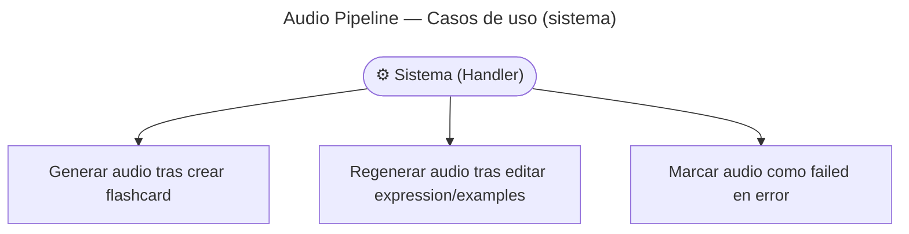

# Audio Pipeline — Casos de Uso

## Reglas de negocio

| Regla                                                                            | Acción                                                                   |
| -------------------------------------------------------------------------------- | ------------------------------------------------------------------------ | -------------------------------------- |
| 4 archivos de audio por flashcard: expression ×3 (US, UK, AU) + examples ×1 (US) | Generados en paralelo                                                    |
| El audio se genera de forma **asíncrona** (no bloquea la creación)               | Disparado por `FlashcardCreatedEvent`                                    |
| Si cambia `expression` o `examples` en una edición → regenerar                   | `FlashcardUpdatedEvent.changedFields` contiene `expression` o `examples` |
| Si cambia solo `meaning`, `ipa`, `nativeSpeech` → NO regenerar                   | El handler ignora el evento                                              |
| La flashcard es visible mientras el audio está pendiente                         | `audioStatus: pending                                                    | generating` → cliente muestra skeleton |
| Error en ElevenLabs o CDN → `audioStatus: failed`                                | El teacher puede editar para reintentar (nueva edición emite evento)     |
| El handler reintenta vía DLQ de AMQP (configurable)                              | `retry: 3, dlq: content.audio.failed`                                    |
