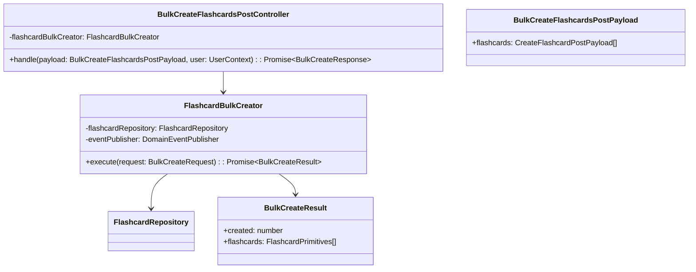

# Bulk Create — Diagrama de Clases

```mermaid
classDiagram
    class BulkCreateFlashcardsPostController {
        -flashcardBulkCreator: FlashcardBulkCreator
        +handle(payload: BulkCreateFlashcardsPostPayload, user: UserContext): Promise~BulkCreateResponse~
    }

    class BulkCreateFlashcardsPostPayload {
        +flashcards: CreateFlashcardPostPayload[]
    }

    class FlashcardBulkCreator {
        -flashcardRepository: FlashcardRepository
        -eventPublisher: DomainEventPublisher
        +execute(request: BulkCreateRequest): Promise~BulkCreateResult~
    }

    class BulkCreateResult {
        +created: number
        +flashcards: FlashcardPrimitives[]
    }

    BulkCreateFlashcardsPostController --> FlashcardBulkCreator
    FlashcardBulkCreator --> FlashcardRepository
    FlashcardBulkCreator --> BulkCreateResult
```
