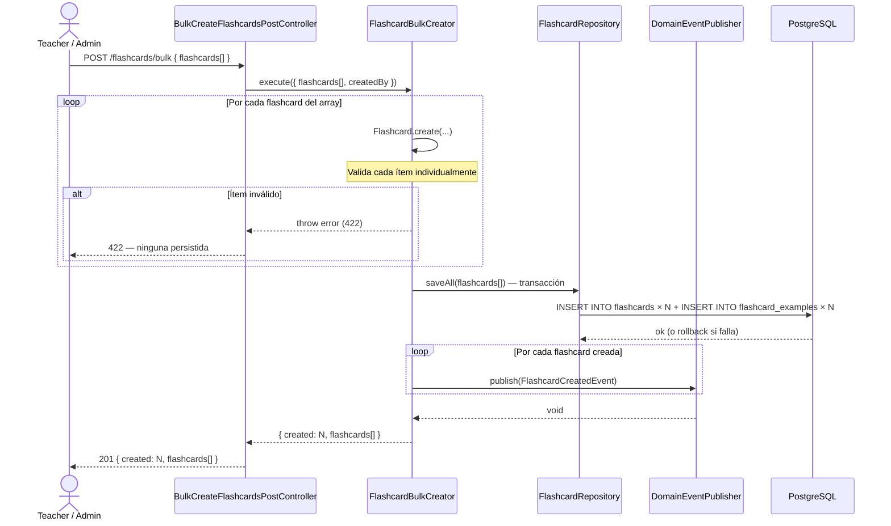

# Bulk Create Flashcards — Diagrama de Secuencia

```mermaid
sequenceDiagram
    actor T as Teacher / Admin
    participant C as BulkCreateFlashcardsPostController
    participant UC as FlashcardBulkCreator
    participant FR as FlashcardRepository
    participant EP as DomainEventPublisher
    participant DB as PostgreSQL

    T->>C: POST /flashcards/bulk { flashcards[] }
    C->>UC: execute({ flashcards[], createdBy })

    loop Por cada flashcard del array
        UC->>UC: Flashcard.create(...)
        Note over UC: Valida cada ítem individualmente
        alt Ítem inválido
            UC-->>C: throw error (422)
            C-->>T: 422 — ninguna persistida
        end
    end

    UC->>FR: saveAll(flashcards[]) — transacción
    FR->>DB: INSERT INTO flashcards × N + INSERT INTO flashcard_examples × N
    DB-->>FR: ok (o rollback si falla)

    loop Por cada flashcard creada
        UC->>EP: publish(FlashcardCreatedEvent)
    end
    EP-->>UC: void

    UC-->>C: { created: N, flashcards[] }
    C-->>T: 201 { created: N, flashcards[] }
```
