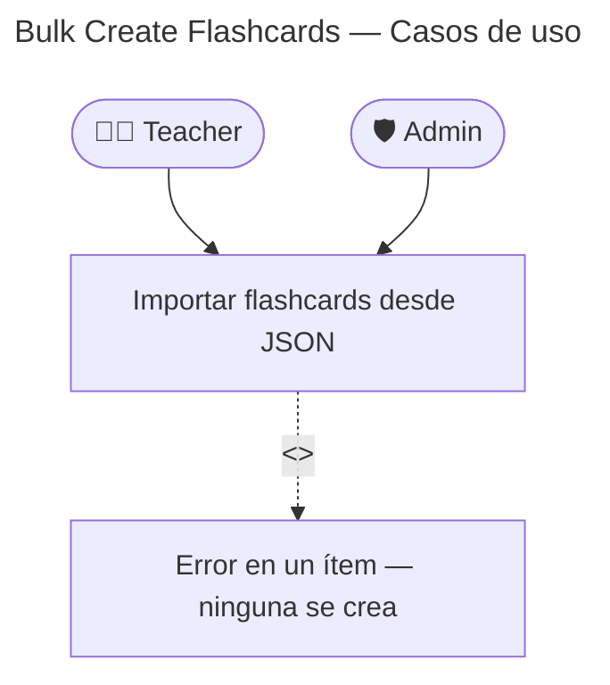

# Bulk Create — Casos de Uso

## Reglas de negocio

| Regla                                                  | Acción                                                    |
| ------------------------------------------------------ | --------------------------------------------------------- |
| Todos los ítems deben ser válidos                      | Si uno falla, la transacción se revierte — 0 creadas      |
| Máximo recomendado: 100 flashcards por request         | No enforced en MVP — añadir en rate limiting si necesario |
| Se emite un `FlashcardCreatedEvent` por cada flashcard | Audio pipeline arranca para cada una                      |
| Útil para importaciones desde hojas de cálculo         | Formato JSON idéntico al formulario individual            |
