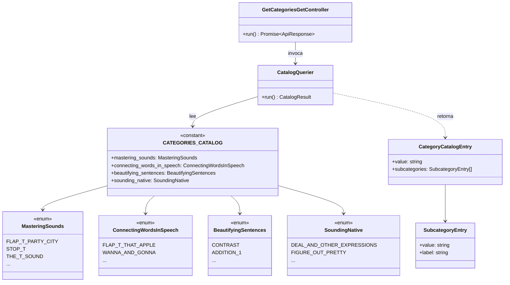

# Classes: Get Categories Catalog

```mermaid
classDiagram
    class CatalogQuerier {
        +run() CatalogResult
    }

    class CATEGORIES_CATALOG {
        <<constant>>
        +mastering_sounds: MasteringSounds
        +connecting_words_in_speech: ConnectingWordsInSpeech
        +beautifying_sentences: BeautifyingSentences
        +sounding_native: SoundingNative
    }

    class MasteringSounds {
        <<enum>>
        FLAP_T_PARTY_CITY
        STOP_T
        THE_T_SOUND
        ...
    }

    class ConnectingWordsInSpeech {
        <<enum>>
        FLAP_T_THAT_APPLE
        WANNA_AND_GONNA
        ...
    }

    class BeautifyingSentences {
        <<enum>>
        CONTRAST
        ADDITION_1
        ...
    }

    class SoundingNative {
        <<enum>>
        DEAL_AND_OTHER_EXPRESSIONS
        FIGURE_OUT_PRETTY
        ...
    }

    class GetCategoriesGetController {
        +run() Promise~ApiResponse~
    }

    class CategoryCatalogEntry {
        +value: string
        +subcategories: SubcategoryEntry[]
    }

    class SubcategoryEntry {
        +value: string
        +label: string
    }

    GetCategoriesGetController --> CatalogQuerier : invoca
    CatalogQuerier --> CATEGORIES_CATALOG : lee
    CATEGORIES_CATALOG --> MasteringSounds
    CATEGORIES_CATALOG --> ConnectingWordsInSpeech
    CATEGORIES_CATALOG --> BeautifyingSentences
    CATEGORIES_CATALOG --> SoundingNative
    CatalogQuerier ..> CategoryCatalogEntry : retorna
    CategoryCatalogEntry --> SubcategoryEntry
```
