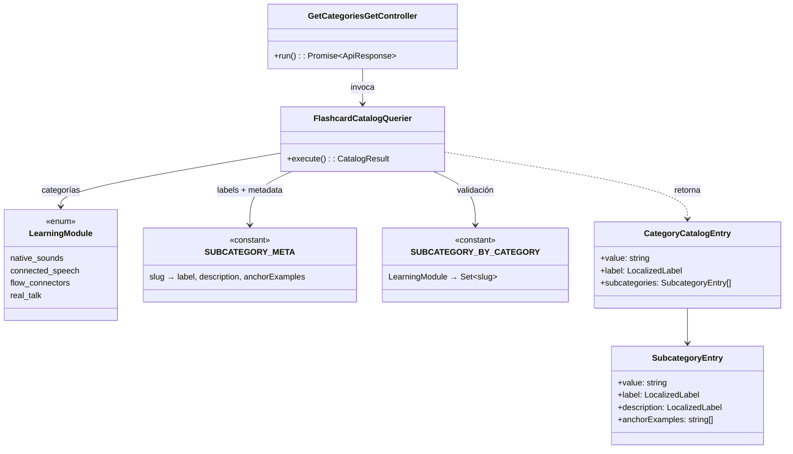

# Classes: Get Categories Catalog

```mermaid
classDiagram
    class FlashcardCatalogQuerier {
        +execute(): CatalogResult
    }

    class LearningModule {
        <<enum>>
        native_sounds
        connected_speech
        flow_connectors
        real_talk
    }

    class SUBCATEGORY_META {
        <<constant>>
        slug → label, description, anchorExamples
    }

    class SUBCATEGORY_BY_CATEGORY {
        <<constant>>
        LearningModule → Set~slug~
    }

    class GetCategoriesGetController {
        +run(): Promise~ApiResponse~
    }

    class CategoryCatalogEntry {
        +value: string
        +label: LocalizedLabel
        +subcategories: SubcategoryEntry[]
    }

    class SubcategoryEntry {
        +value: string
        +label: LocalizedLabel
        +description: LocalizedLabel
        +anchorExamples: string[]
    }

    GetCategoriesGetController --> FlashcardCatalogQuerier : invoca
    FlashcardCatalogQuerier --> LearningModule : categorías
    FlashcardCatalogQuerier --> SUBCATEGORY_META : labels + metadata
    FlashcardCatalogQuerier --> SUBCATEGORY_BY_CATEGORY : validación
    FlashcardCatalogQuerier ..> CategoryCatalogEntry : retorna
    CategoryCatalogEntry --> SubcategoryEntry
```
