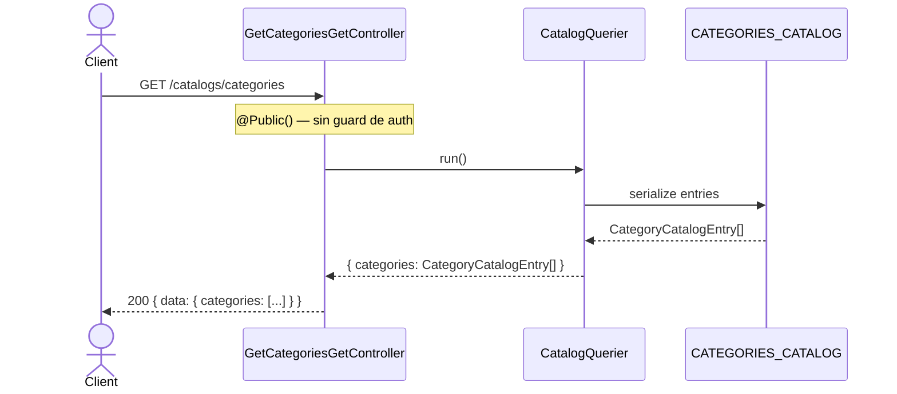

# Sequence: Get Categories Catalog

```mermaid
sequenceDiagram
    actor Client
    participant Controller as GetCategoriesGetController
    participant UC as CatalogQuerier
    participant Catalog as CATEGORIES_CATALOG

    Client->>Controller: GET /catalogs/categories
    Note over Controller: @Public() — sin guard de auth
    Controller->>UC: run()
    UC->>Catalog: serialize entries
    Catalog-->>UC: CategoryCatalogEntry[]
    UC-->>Controller: { categories: CategoryCatalogEntry[] }
    Controller-->>Client: 200 { data: { categories: [...] } }
```

> No hay repositorio, no hay DB, no hay eventos.  
> `CATEGORIES_CATALOG` es un map estático de enums TypeScript serializado en runtime.
