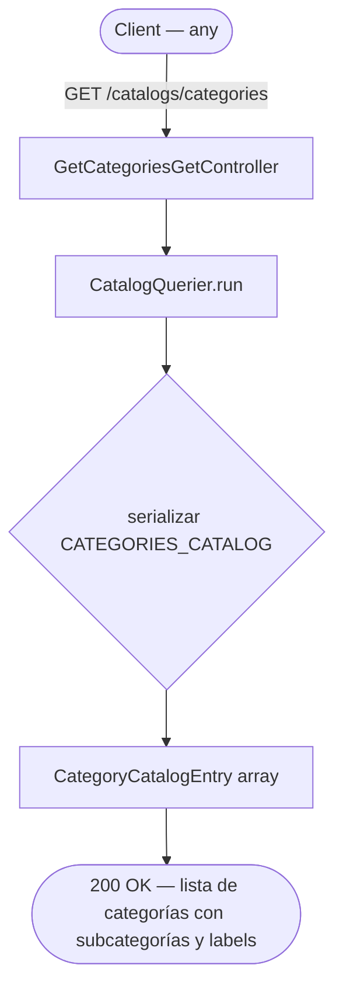

# Use Cases: Get Categories Catalog

## Notas

- No requiere autenticación (`@Public()`)
- No consulta DB ni repositorio alguno
- La respuesta es determinista y cacheable en cliente (no cambia entre deploys)
- Los labels son para presentación — el valor que se envía al backend al crear una flashcard es el `value` del enum
