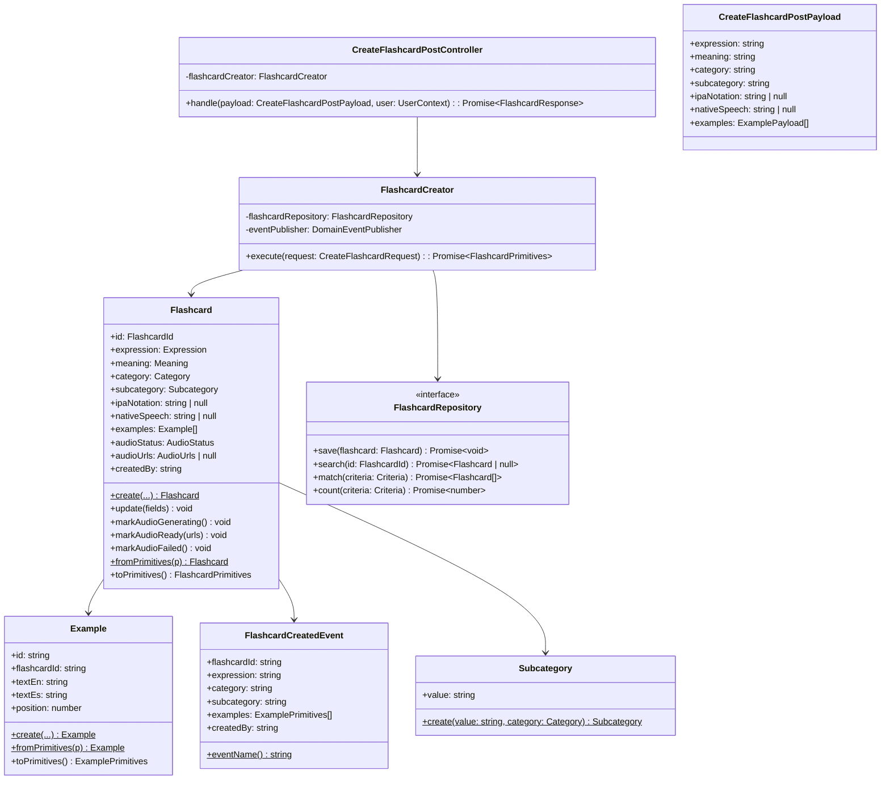

# Create Flashcard — Diagrama de Clases

```mermaid
classDiagram
    class CreateFlashcardPostController {
        -flashcardCreator: FlashcardCreator
        +handle(payload: CreateFlashcardPostPayload, user: UserContext): Promise~FlashcardResponse~
    }

    class CreateFlashcardPostPayload {
        +expression: string
        +meaning: string
        +category: string
        +subcategory: string
        +ipaNotation: string | null
        +nativeSpeech: string | null
        +examples: ExamplePayload[]
    }

    class FlashcardCreator {
        -flashcardRepository: FlashcardRepository
        -eventPublisher: DomainEventPublisher
        +execute(request: CreateFlashcardRequest): Promise~FlashcardPrimitives~
    }

    class Flashcard {
        +id: FlashcardId
        +expression: Expression
        +meaning: Meaning
        +category: Category
        +subcategory: Subcategory
        +ipaNotation: string | null
        +nativeSpeech: string | null
        +examples: Example[]
        +audioStatus: AudioStatus
        +audioUrls: AudioUrls | null
        +createdBy: string
        +create(...)$ Flashcard
        +update(fields) void
        +markAudioGenerating() void
        +markAudioReady(urls) void
        +markAudioFailed() void
        +fromPrimitives(p)$ Flashcard
        +toPrimitives() FlashcardPrimitives
    }

    class Example {
        +id: string
        +flashcardId: string
        +textEn: string
        +textEs: string
        +position: number
        +create(...)$ Example
        +fromPrimitives(p)$ Example
        +toPrimitives() ExamplePrimitives
    }

    class FlashcardCreatedEvent {
        +eventName()$ string
        +flashcardId: string
        +expression: string
        +category: string
        +subcategory: string
        +examples: ExamplePrimitives[]
        +createdBy: string
    }

    class Subcategory {
        +value: string
        +create(value: string, category: Category)$ Subcategory
    }

    class FlashcardRepository {
        <<interface>>
        +save(flashcard: Flashcard) Promise~void~
        +search(id: FlashcardId) Promise~Flashcard | null~
        +match(criteria: Criteria) Promise~Flashcard[]~
        +count(criteria: Criteria) Promise~number~
    }

    CreateFlashcardPostController --> FlashcardCreator
    FlashcardCreator --> Flashcard
    FlashcardCreator --> FlashcardRepository
    Flashcard --> Example
    Flashcard --> FlashcardCreatedEvent
    Flashcard --> Subcategory
```
