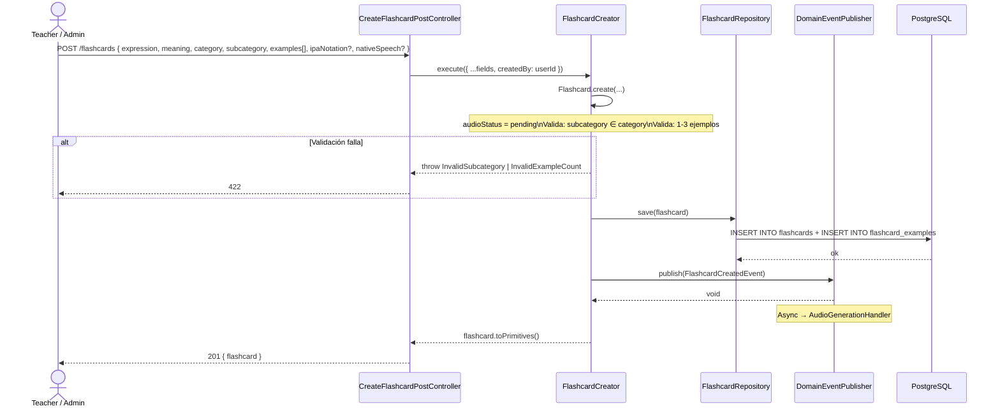

# Create Flashcard — Diagrama de Secuencia

```mermaid
sequenceDiagram
    actor T as Teacher / Admin
    participant C as CreateFlashcardPostController
    participant UC as FlashcardCreator
    participant FR as FlashcardRepository
    participant EP as DomainEventPublisher
    participant DB as PostgreSQL

    T->>C: POST /flashcards { expression, meaning, category, subcategory, examples[], ipaNotation?, nativeSpeech? }
    C->>UC: execute({ ...fields, createdBy: userId })

    UC->>UC: Flashcard.create(...)
    Note over UC: audioStatus = pending\nValida: subcategory ∈ category\nValida: 1-3 ejemplos

    alt Validación falla
        UC-->>C: throw InvalidSubcategory | InvalidExampleCount
        C-->>T: 422
    end

    UC->>FR: save(flashcard)
    FR->>DB: INSERT INTO flashcards + INSERT INTO flashcard_examples
    DB-->>FR: ok

    UC->>EP: publish(FlashcardCreatedEvent)
    EP-->>UC: void
    Note over EP: Async → AudioGenerationHandler

    UC-->>C: flashcard.toPrimitives()
    C-->>T: 201 { flashcard }
```
