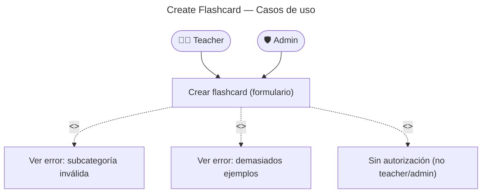

# Create Flashcard — Casos de Uso

## Reglas de negocio

| Regla                                                    | Acción                                                 |
| -------------------------------------------------------- | ------------------------------------------------------ |
| Solo `teacher` y `admin` pueden crear                    | 403 si rol no autorizado                               |
| La subcategoría debe pertenecer a la categoría           | `InvalidSubcategory` (422)                             |
| Entre 1 y 3 ejemplos obligatorios                        | `InvalidExampleCount` (422)                            |
| La flashcard se publica directamente (sin draft)         | `audioStatus: pending` desde el inicio                 |
| El audio se genera de forma asíncrona                    | `FlashcardCreatedEvent` → `AudioGenerationHandler`     |
| La flashcard es visible antes de que el audio esté listo | El cliente muestra skeleton si `audioStatus !== ready` |
