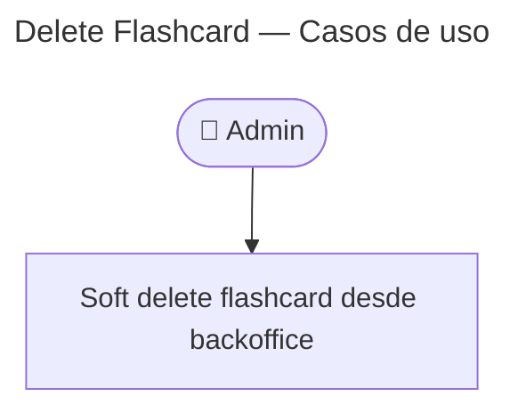

# Delete Flashcard — Casos de Uso

## Endpoint

`DELETE /v1/flashcards/:id` — admin, **204 No Content**

## Reglas de negocio

| Regla | Detalle |
|-------|---------|
| Soft delete | Se setea `deleted_at = now()` — no hay `DELETE` físico |
| Backoffice | La flashcard desaparece de listados y búsquedas admin |
| Partidas activas | `game_flashcards` sigue resolviendo la fila (JOIN intacto) |
| Nuevas partidas | `TypeOrmFlashcardSelector` excluye `deleted_at IS NOT NULL` |
| Progreso / estudio | Totales por módulo excluyen flashcards borradas |
| Idempotencia | Segundo delete sobre la misma id → **404** (ya no visible en repo) |

## Precondiciones

- JWT admin válido
- Flashcard existe y `deleted_at IS NULL`

## Postcondiciones

- Fila conservada en BD con `deleted_at` poblado
- No aparece en `GET /v1/flashcards` ni `GET /v1/flashcards/:id`
