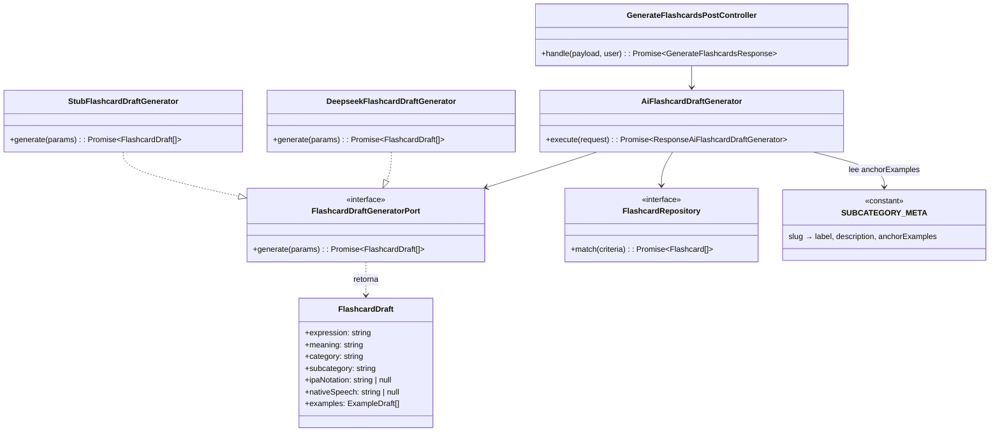

# Generate Flashcards — Diagrama de Clases

```mermaid
classDiagram
    class GenerateFlashcardsPostController {
        +handle(payload, user): Promise~GenerateFlashcardsResponse~
    }

    class AiFlashcardDraftGenerator {
        +execute(request): Promise~ResponseAiFlashcardDraftGenerator~
    }

    class FlashcardDraftGeneratorPort {
        <<interface>>
        +generate(params): Promise~FlashcardDraft[]~
    }

    class DeepseekFlashcardDraftGenerator {
        +generate(params): Promise~FlashcardDraft[]~
    }

    class StubFlashcardDraftGenerator {
        +generate(params): Promise~FlashcardDraft[]~
    }

    class FlashcardRepository {
        <<interface>>
        +match(criteria): Promise~Flashcard[]~
    }

    class FlashcardDraft {
        +expression: string
        +meaning: string
        +category: string
        +subcategory: string
        +ipaNotation: string | null
        +nativeSpeech: string | null
        +examples: ExampleDraft[]
    }

    class SUBCATEGORY_META {
        <<constant>>
        slug → label, description, anchorExamples
    }

    GenerateFlashcardsPostController --> AiFlashcardDraftGenerator
    AiFlashcardDraftGenerator --> FlashcardDraftGeneratorPort
    AiFlashcardDraftGenerator --> FlashcardRepository
    AiFlashcardDraftGenerator --> SUBCATEGORY_META : lee anchorExamples
    DeepseekFlashcardDraftGenerator ..|> FlashcardDraftGeneratorPort
    StubFlashcardDraftGenerator ..|> FlashcardDraftGeneratorPort
    FlashcardDraftGeneratorPort ..> FlashcardDraft : retorna
```
