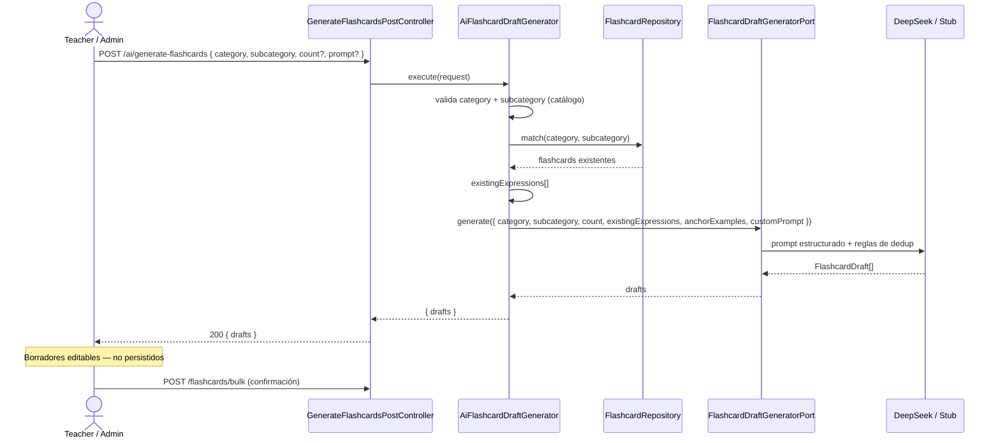

# Generate Flashcards — Diagrama de Secuencia

```mermaid
sequenceDiagram
    actor T as Teacher / Admin
    participant C as GenerateFlashcardsPostController
    participant UC as AiFlashcardDraftGenerator
    participant FR as FlashcardRepository
    participant GEN as FlashcardDraftGeneratorPort
    participant LLM as DeepSeek / Stub

    T->>C: POST /ai/generate-flashcards { category, subcategory, count?, prompt? }
    C->>UC: execute(request)

    UC->>UC: valida category + subcategory (catálogo)
    UC->>FR: match(category, subcategory)
    FR-->>UC: flashcards existentes
    UC->>UC: existingExpressions[]

    UC->>GEN: generate({ category, subcategory, count, existingExpressions, anchorExamples, customPrompt })
    GEN->>LLM: prompt estructurado + reglas de dedup
    LLM-->>GEN: FlashcardDraft[]
    GEN-->>UC: drafts

    UC-->>C: { drafts }
    C-->>T: 200 { drafts }
    Note over T: Borradores editables — no persistidos
    T->>C: POST /flashcards/bulk (confirmación)
```
