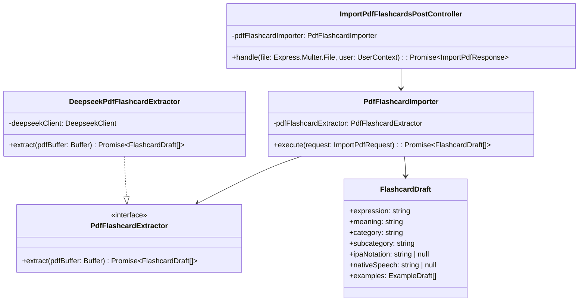

# Import PDF — Diagrama de Clases

```mermaid
classDiagram
    class ImportPdfFlashcardsPostController {
        -pdfFlashcardImporter: PdfFlashcardImporter
        +handle(file: Express.Multer.File, user: UserContext): Promise~ImportPdfResponse~
    }

    class PdfFlashcardImporter {
        -pdfFlashcardExtractor: PdfFlashcardExtractor
        +execute(request: ImportPdfRequest): Promise~FlashcardDraft[]~
    }

    class PdfFlashcardExtractor {
        <<interface>>
        +extract(pdfBuffer: Buffer) Promise~FlashcardDraft[]~
    }

    class DeepseekPdfFlashcardExtractor {
        -deepseekClient: DeepseekClient
        +extract(pdfBuffer: Buffer) Promise~FlashcardDraft[]~
    }

    class FlashcardDraft {
        +expression: string
        +meaning: string
        +category: string
        +subcategory: string
        +ipaNotation: string | null
        +nativeSpeech: string | null
        +examples: ExampleDraft[]
    }

    ImportPdfFlashcardsPostController --> PdfFlashcardImporter
    PdfFlashcardImporter --> PdfFlashcardExtractor
    DeepseekPdfFlashcardExtractor ..|> PdfFlashcardExtractor
    PdfFlashcardImporter --> FlashcardDraft
```
