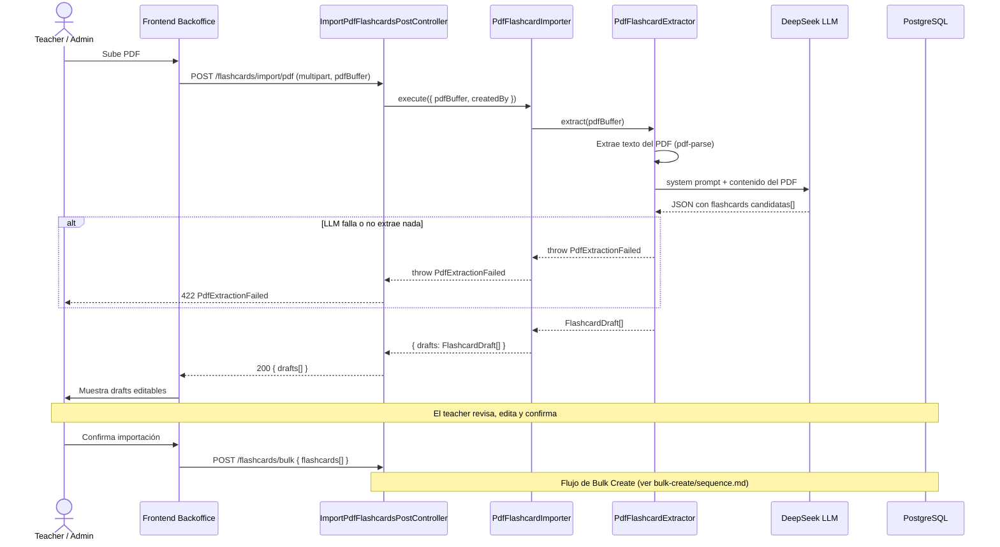

# Import PDF — Diagrama de Secuencia

```mermaid
sequenceDiagram
    actor T as Teacher / Admin
    participant FE as Frontend Backoffice
    participant C as ImportPdfFlashcardsPostController
    participant UC as PdfFlashcardImporter
    participant EX as PdfFlashcardExtractor
    participant LLM as DeepSeek LLM
    participant DB as PostgreSQL

    T->>FE: Sube PDF
    FE->>C: POST /flashcards/import/pdf (multipart, pdfBuffer)
    C->>UC: execute({ pdfBuffer, createdBy })

    UC->>EX: extract(pdfBuffer)
    EX->>EX: Extrae texto del PDF (pdf-parse)
    EX->>LLM: system prompt + contenido del PDF
    LLM-->>EX: JSON con flashcards candidatas[]

    alt LLM falla o no extrae nada
        EX-->>UC: throw PdfExtractionFailed
        UC-->>C: throw PdfExtractionFailed
        C-->>T: 422 PdfExtractionFailed
    end

    EX-->>UC: FlashcardDraft[]
    UC-->>C: { drafts: FlashcardDraft[] }
    C-->>FE: 200 { drafts[] }
    FE->>T: Muestra drafts editables

    note over T,DB: El teacher revisa, edita y confirma

    T->>FE: Confirma importación
    FE->>C: POST /flashcards/bulk { flashcards[] }
    Note over C,DB: Flujo de Bulk Create (ver bulk-create/sequence.md)
```
