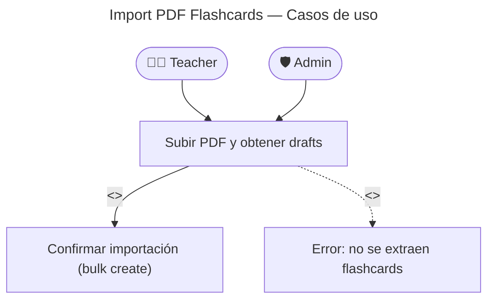

# Import PDF — Casos de Uso

## Reglas de negocio

| Regla                                                        | Acción                                                                   |
| ------------------------------------------------------------ | ------------------------------------------------------------------------ |
| `PdfFlashcardImporter` NO persiste — solo extrae             | La persistencia ocurre en el flujo Bulk Create                           |
| El LLM puede no extraer flashcards útiles                    | `PdfExtractionFailed` (422)                                              |
| Los drafts son editables en el frontend                      | El teacher revisa antes de confirmar                                     |
| El system prompt estructura la respuesta del LLM             | JSON con campos `expression, meaning, category, subcategory, examples[]` |
| `ipaNotation` y `nativeSpeech` pueden ser null en los drafts | El teacher puede completarlos manualmente                                |
