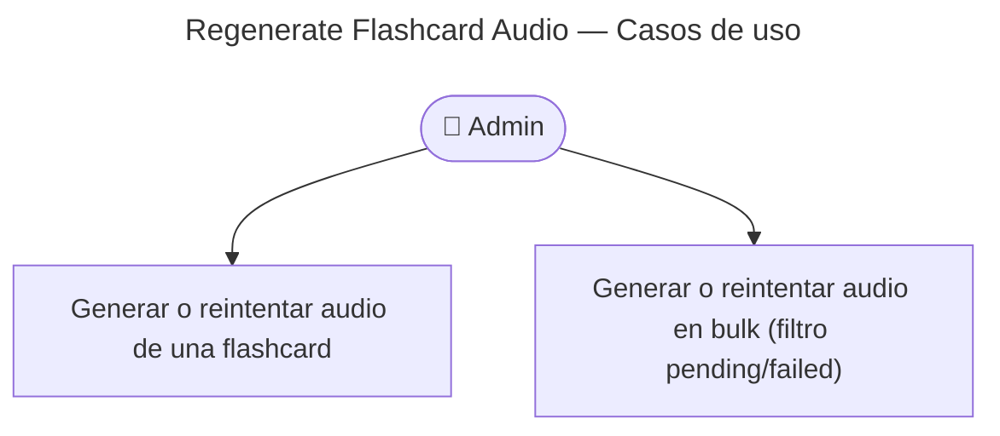

# Regenerate Flashcard Audio — Casos de Uso



## Diseño REST

Las acciones sobre el pipeline de audio se agrupan bajo el sub-recurso **`audio`**, siguiendo el patrón DDD del repo (`POST /games/:id/complete`, `POST /games/:id/attempts`):

| Alcance | Método | Ruta | Respuesta |
|---------|--------|------|-----------|
| Una flashcard | `POST` | `/v1/flashcards/:id/audio/regenerates` | **204** No Content |
| Colección filtrada | `POST` | `/v1/flashcards/audio/regenerates` | **200** `{ triggered: number }` |

**Por qué no** `regenerate-audio` / `regenerate-audio-bulk`:

- Mezclaban verbo + sustantivo en un solo segmento (`regenerate-audio-bulk`).
- El bulk no colgaba de un sub-recurso semántico (`audio`).

**Por qué `regenerates` (plural):**

- Acción de dominio idempotente-en-intención (disparar generación), alineada con recursos de acción en plural del proyecto (`attempts`).
- `audio-regenerates` como un solo segmento sería menos claro al anidar bajo `:id`.

Requiere JWT **admin**. `@SkipThrottle()` en backoffice (polling + bulk).

---

## POST /v1/flashcards/:id/audio/regenerates

Retry o arranque manual del pipeline para **una** flashcard.

### Reglas de negocio

| Regla | Detalle |
|-------|---------|
| Estados permitidos | `pending`, `generating` (stuck), `failed` |
| Estado rechazado | `ready` → **422** (`AudioStatusInvalid`) |
| Flashcard borrada | **404** |
| Ejecución | Async: responde **204** y `FlashcardAudioGenerator` corre en background |

### Precondiciones

- JWT admin válido
- Flashcard no borrada (`deleted_at IS NULL`)

### Postcondiciones

- `audio_status` pasa a `generating` y luego `ready` o `failed`

---

## POST /v1/flashcards/audio/regenerates

Encola generación de audio para **todas** las flashcards que coincidan con el filtro (todas las páginas, no solo la visible).

### Body

```json
{
  "audioStatus": "pending",
  "category": "connected_speech",
  "subcategory": "informal_going_to"
}
```

| Campo | Obligatorio | Valores |
|-------|-------------|---------|
| `audioStatus` | Sí | `pending` \| `failed` |
| `category` | No | Mismo filtro que `GET /flashcards` |
| `subcategory` | No | Mismo filtro que `GET /flashcards` |

### Respuesta

```json
{
  "data": { "triggered": 12 },
  "meta": { "timestamp": "...", "request_id": "..." }
}
```

`triggered` = flashcards para las que se llamó a `FlashcardAudioGenerator` (puede ser `0`).

### UI backoffice

- Botón visible al filtrar por **Pendiente** o **Fallido**
- Etiqueta incluye `total_items` del filtro activo
- Respeta categoría/subcategoría si están seleccionadas

---

## Regeneración automática (eventos)

Al **crear** flashcard, el subscriber `EnrichFlashcardOnFlashcardCreated` ejecuta ejemplos → fonética → audio en la misma cadena RabbitMQ.

Al **editar** `expression` o `examples`, los subscribers de dominio también invocan `FlashcardAudioGenerator`.

Los endpoints anteriores son el **retry/arranque explícito** sin editar contenido.

## Troubleshooting

Ver [troubleshooting/audio-generation.md](../../../../troubleshooting/audio-generation.md).
