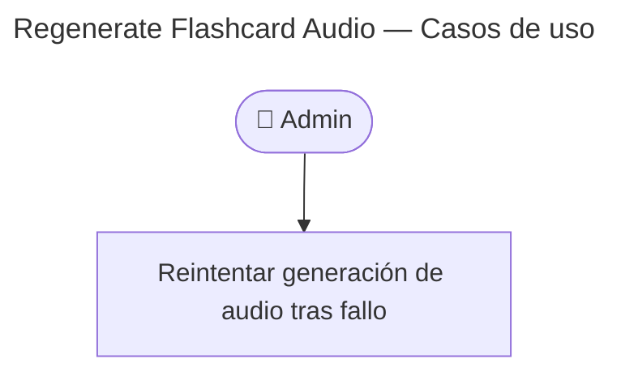

# Regenerate Flashcard Audio — Casos de Uso

## Endpoint

`POST /v1/flashcards/:id/regenerate-audio` — admin, **204 No Content**

## Reglas de negocio

| Regla | Detalle |
|-------|---------|
| Solo desde `failed` | Si `audioStatus !== failed` → **422** (`AudioStatusInvalid`) |
| Flashcard borrada | Tratada como no encontrada → **404** |
| Ejecución | Delega en `FlashcardAudioGenerator.execute` (mismo pipeline que eventos) |
| Resultado exitoso | `generating` → `ready` con URLs en CDN |
| Resultado error | Vuelve a `failed`; ver [troubleshooting](../../../../troubleshooting/audio-generation.md) |

## Precondiciones

- JWT admin válido
- Flashcard con `audio_status = failed`

## Postcondiciones

- Audio regenerado o flashcard permanece en `failed` con log/métrica de error

## Relación con regeneración automática

Editar `expression` o `examples` dispara eventos que también invocan `FlashcardAudioGenerator`. Este endpoint es el **retry explícito** sin editar contenido.
