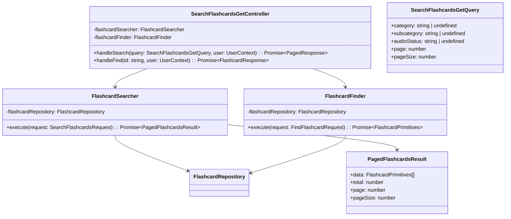

# Search Flashcards — Diagrama de Clases

```mermaid
classDiagram
    class SearchFlashcardsGetController {
        -flashcardSearcher: FlashcardSearcher
        -flashcardFinder: FlashcardFinder
        +handleSearch(query: SearchFlashcardsGetQuery, user: UserContext): Promise~PagedResponse~
        +handleFind(id: string, user: UserContext): Promise~FlashcardResponse~
    }

    class SearchFlashcardsGetQuery {
        +category: string | undefined
        +subcategory: string | undefined
        +audioStatus: string | undefined
        +page: number
        +pageSize: number
    }

    class FlashcardSearcher {
        -flashcardRepository: FlashcardRepository
        +execute(request: SearchFlashcardsRequest): Promise~PagedFlashcardsResult~
    }

    class FlashcardFinder {
        -flashcardRepository: FlashcardRepository
        +execute(request: FindFlashcardRequest): Promise~FlashcardPrimitives~
    }

    class PagedFlashcardsResult {
        +data: FlashcardPrimitives[]
        +total: number
        +page: number
        +pageSize: number
    }

    SearchFlashcardsGetController --> FlashcardSearcher
    SearchFlashcardsGetController --> FlashcardFinder
    FlashcardSearcher --> FlashcardRepository
    FlashcardFinder --> FlashcardRepository
    FlashcardSearcher --> PagedFlashcardsResult
```
