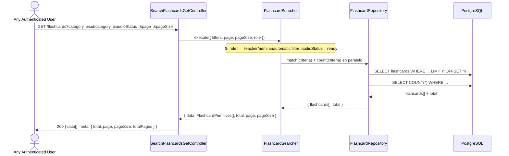

# Search Flashcards — Diagrama de Secuencia

```mermaid
sequenceDiagram
    actor U as Any Authenticated User
    participant C as SearchFlashcardsGetController
    participant UC as FlashcardSearcher
    participant FR as FlashcardRepository
    participant DB as PostgreSQL

    U->>C: GET /flashcards?category=&subcategory=&audioStatus=&page=&pageSize=
    C->>UC: execute({ filters, page, pageSize, role })

    Note over UC: Si role !== teacher/admin\nautomatic filter: audioStatus = ready

    UC->>FR: match(criteria) + count(criteria) en paralelo
    FR->>DB: SELECT flashcards WHERE ... LIMIT n OFFSET m
    FR->>DB: SELECT COUNT(*) WHERE ...
    DB-->>FR: flashcards[] + total
    FR-->>UC: { flashcards[], total }

    UC-->>C: { data: FlashcardPrimitives[], total, page, pageSize }
    C-->>U: 200 { data[], meta: { total, page, pageSize, totalPages } }
```
