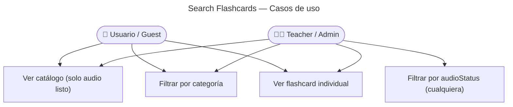

# Search Flashcards — Casos de Uso

## Reglas de negocio

| Regla                                                           | Acción                                            |
| --------------------------------------------------------------- | ------------------------------------------------- |
| Usuario `user`/`guest` solo ve `audioStatus: ready`             | Filtro automático aplicado en use case según rol  |
| Teacher/Admin puede filtrar por cualquier `audioStatus`         | Útil para ver pendientes y fallidas en backoffice |
| Paginación obligatoria                                          | Default: `page=1`, `pageSize=20`                  |
| Respuesta incluye `meta: { total, page, pageSize, totalPages }` | Patrón envelope del proyecto                      |
