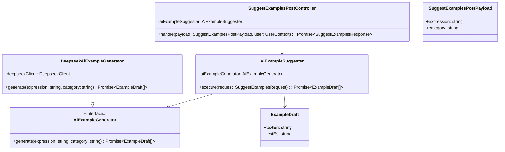

# Suggest Examples — Diagrama de Clases

```mermaid
classDiagram
    class SuggestExamplesPostController {
        -aiExampleSuggester: AiExampleSuggester
        +handle(payload: SuggestExamplesPostPayload, user: UserContext): Promise~SuggestExamplesResponse~
    }

    class SuggestExamplesPostPayload {
        +expression: string
        +category: string
    }

    class AiExampleSuggester {
        -aiExampleGenerator: AiExampleGenerator
        +execute(request: SuggestExamplesRequest): Promise~ExampleDraft[]~
    }

    class AiExampleGenerator {
        <<interface>>
        +generate(expression: string, category: string) Promise~ExampleDraft[]~
    }

    class DeepseekAiExampleGenerator {
        -deepseekClient: DeepseekClient
        +generate(expression: string, category: string) Promise~ExampleDraft[]~
    }

    class ExampleDraft {
        +textEn: string
        +textEs: string
    }

    SuggestExamplesPostController --> AiExampleSuggester
    AiExampleSuggester --> AiExampleGenerator
    DeepseekAiExampleGenerator ..|> AiExampleGenerator
    AiExampleSuggester --> ExampleDraft
```
