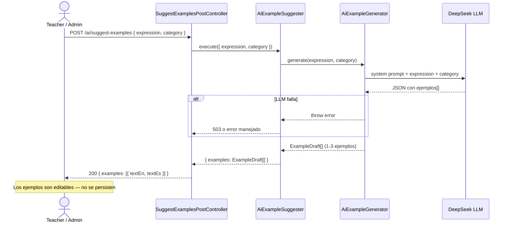

# Suggest Examples — Diagrama de Secuencia

```mermaid
sequenceDiagram
    actor T as Teacher / Admin
    participant C as SuggestExamplesPostController
    participant UC as AiExampleSuggester
    participant GEN as AiExampleGenerator
    participant LLM as DeepSeek LLM

    T->>C: POST /ai/suggest-examples { expression, category }
    C->>UC: execute({ expression, category })

    UC->>GEN: generate(expression, category)
    GEN->>LLM: system prompt + expression + category
    LLM-->>GEN: JSON con ejemplos[]

    alt LLM falla
        GEN-->>UC: throw error
        UC-->>C: 503 o error manejado
    end

    GEN-->>UC: ExampleDraft[] (1-3 ejemplos)
    UC-->>C: { examples: ExampleDraft[] }
    C-->>T: 200 { examples: [{ textEn, textEs }] }
    Note over T: Los ejemplos son editables — no se persisten
```
