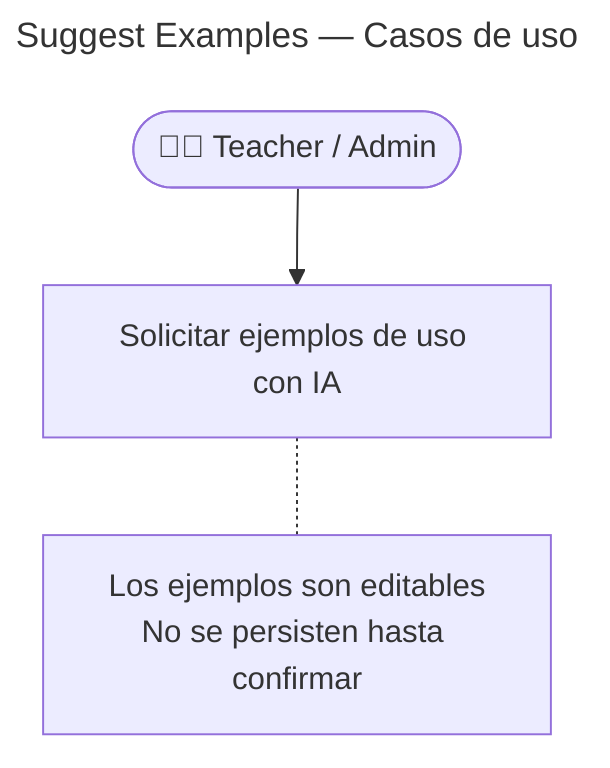

# Suggest Examples — Casos de Uso

## Reglas de negocio

| Regla                                    | Acción                                                       |
| ---------------------------------------- | ------------------------------------------------------------ |
| Solo disponible para `teacher` y `admin` | 403 si rol no autorizado                                     |
| Los ejemplos NO se persisten             | Son drafts para revisión del teacher                         |
| El LLM devuelve entre 1 y 3 ejemplos     | Validado en `DeepseekAiExampleGenerator`                     |
| El prompt incluye expresión + categoría  | Para que el LLM contextualice el registro de inglés          |
| Si el LLM falla                          | Error manejado graciosamente — no rompe el flujo de creación |
