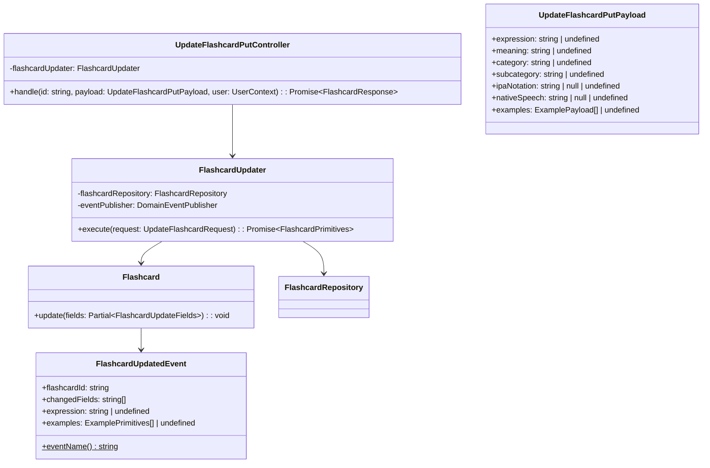

# Update Flashcard — Diagrama de Clases

```mermaid
classDiagram
    class UpdateFlashcardPutController {
        -flashcardUpdater: FlashcardUpdater
        +handle(id: string, payload: UpdateFlashcardPutPayload, user: UserContext): Promise~FlashcardResponse~
    }

    class UpdateFlashcardPutPayload {
        +expression: string | undefined
        +meaning: string | undefined
        +category: string | undefined
        +subcategory: string | undefined
        +ipaNotation: string | null | undefined
        +nativeSpeech: string | null | undefined
        +examples: ExamplePayload[] | undefined
    }

    class FlashcardUpdater {
        -flashcardRepository: FlashcardRepository
        -eventPublisher: DomainEventPublisher
        +execute(request: UpdateFlashcardRequest): Promise~FlashcardPrimitives~
    }

    class FlashcardUpdatedEvent {
        +eventName()$ string
        +flashcardId: string
        +changedFields: string[]
        +expression: string | undefined
        +examples: ExamplePrimitives[] | undefined
    }

    class Flashcard {
        +update(fields: Partial~FlashcardUpdateFields~): void
    }

    UpdateFlashcardPutController --> FlashcardUpdater
    FlashcardUpdater --> FlashcardRepository
    FlashcardUpdater --> Flashcard
    Flashcard --> FlashcardUpdatedEvent
```
