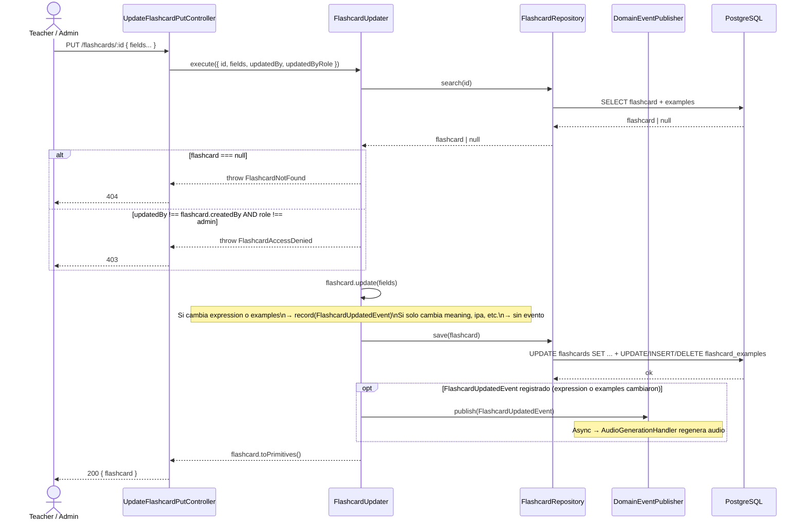

# Update Flashcard — Diagrama de Secuencia

```mermaid
sequenceDiagram
    actor T as Teacher / Admin
    participant C as UpdateFlashcardPutController
    participant UC as FlashcardUpdater
    participant FR as FlashcardRepository
    participant EP as DomainEventPublisher
    participant DB as PostgreSQL

    T->>C: PUT /flashcards/:id { fields... }
    C->>UC: execute({ id, fields, updatedBy, updatedByRole })

    UC->>FR: search(id)
    FR->>DB: SELECT flashcard + examples
    DB-->>FR: flashcard | null
    FR-->>UC: flashcard | null

    alt flashcard === null
        UC-->>C: throw FlashcardNotFound
        C-->>T: 404
    else updatedBy !== flashcard.createdBy AND role !== admin
        UC-->>C: throw FlashcardAccessDenied
        C-->>T: 403
    end

    UC->>UC: flashcard.update(fields)
    Note over UC: Si cambia expression o examples\n→ record(FlashcardUpdatedEvent)\nSi solo cambia meaning, ipa, etc.\n→ sin evento

    UC->>FR: save(flashcard)
    FR->>DB: UPDATE flashcards SET ... + UPDATE/INSERT/DELETE flashcard_examples
    DB-->>FR: ok

    opt FlashcardUpdatedEvent registrado (expression o examples cambiaron)
        UC->>EP: publish(FlashcardUpdatedEvent)
        Note over EP: Async → AudioGenerationHandler regenera audio
    end

    UC-->>C: flashcard.toPrimitives()
    C-->>T: 200 { flashcard }
```
