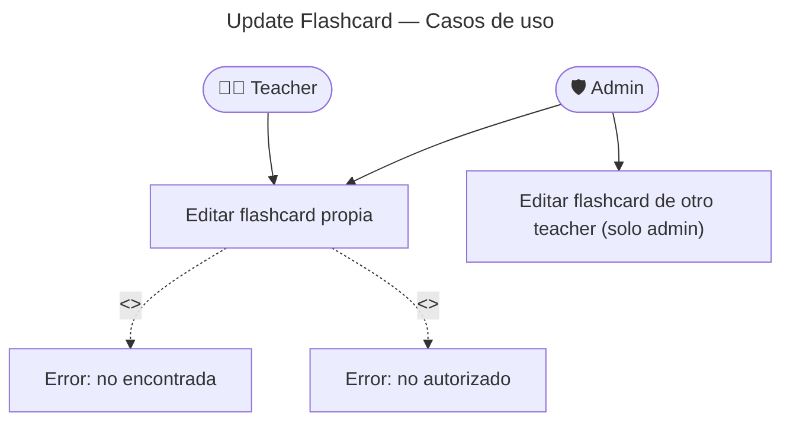

# Update Flashcard — Casos de Uso

## Reglas de negocio

| Regla                                                                 | Acción                                                     |
| --------------------------------------------------------------------- | ---------------------------------------------------------- |
| Teacher solo puede editar sus propias flashcards                      | `FlashcardAccessDenied` (403) si `createdBy !== updatedBy` |
| Admin puede editar cualquier flashcard                                | Verificación de rol en use case                            |
| Cambio en `expression` o `examples` → regenerar audio                 | Se emite `FlashcardUpdatedEvent`                           |
| Cambio en `meaning`, `ipa`, `nativeSpeech` → sin audio                | NO se emite evento                                         |
| Si el audio estaba `ready` y se edita expression → vuelve a `pending` | `markAudioGenerating()` en el handler                      |
