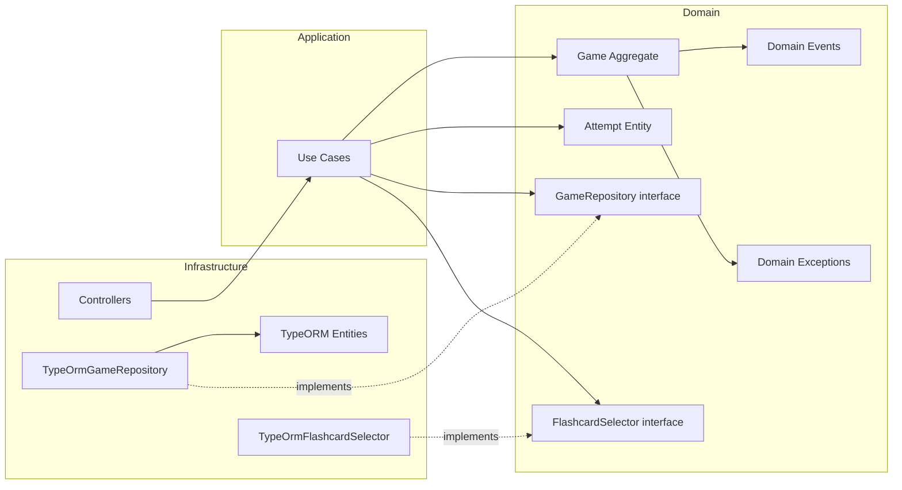

# Gaming BC — Documentación

> Bounded Context responsable del ciclo de vida de los juegos y registro de intentos en ididntcatchthat.

## Flujos de negocio

Cada flujo tiene 3 diagramas: secuencia, clases y casos de uso.

| Flujo | Descripción | Diagramas |
|---|---|---|
| [Start](./start/) | Iniciar una partida (modo estudio o juego) | [Secuencia](./start/sequence.md) · [Clases](./start/classes.md) · [Casos de uso](./start/usecases.md) |
| [Attempt](./attempt/) | Registrar un intento (respuesta a flashcard) | [Secuencia](./attempt/sequence.md) · [Clases](./attempt/classes.md) · [Casos de uso](./attempt/usecases.md) |
| [Complete](./complete/) | Completar una partida y obtener resumen | [Secuencia](./complete/sequence.md) · [Clases](./complete/classes.md) · [Casos de uso](./complete/usecases.md) |
| [Pause](./pause/) | Pausar y retomar una partida | [Secuencia](./pause/sequence.md) · [Clases](./pause/classes.md) · [Casos de uso](./pause/usecases.md) |
| [Resume](./resume/) | Retomar una partida pausada | [Secuencia](./resume/sequence.md) · [Clases](./resume/classes.md) · [Casos de uso](./resume/usecases.md) |
| [Abandon](./abandon/) | Abandonar una partida explícitamente | [Secuencia](./abandon/sequence.md) · [Clases](./abandon/classes.md) · [Casos de uso](./abandon/usecases.md) |

---

## Mapa de endpoints

| Método | Ruta | Flujo | Auth |
|---|---|---|---|
| `POST` | `/games` | [Start](./start/) | Bearer (any) |
| `POST` | `/games/:id/attempts` | [Attempt](./attempt/) | Bearer (any) |
| `POST` | `/games/:id/complete` | [Complete](./complete/) | Bearer (any) |
| `GET` | `/games/:id/summary` | [Complete](./complete/) | Bearer (any) |
| `PATCH` | `/games/:id` (`status: paused`) | [Pause](./pause/) | Bearer (user) |
| `GET` | `/games?status=paused` | [Pause](./pause/) | Bearer (user) |
| `GET` | `/games/:id/resume` | [Resume](./resume/) | Bearer (user) |
| `PATCH` | `/games/:id` (`status: abandoned`) | [Abandon](./abandon/) | Bearer (user) |

---

## Arquitectura general

> **Regla de dependencias**: `Infrastructure` → `Application` → `Domain`. Nunca al revés.

---

## Domain Events publicados al bus

| Evento | Exchange | Consumers |
|---|---|---|
| `AttemptRecordedEvent` | `idct.gaming.attempts.attempt.recorded` | BC Progress |
| `GameCompletedEvent` | `idct.gaming.games.game.completed` | BC Progress, BC Identity (streak) |

> `GamePausedEvent` y `GameAbandonedEvent` son internos — no se publican al AMQP.

---

## Referencias

- [Spec de Gaming](../../../spec/gaming.md)
- [Tasks](../../../tasks/gaming.md)
- [Domain Model](../../../domain/domain-model.md)
- [Game Mechanics](../../../domain/game-mechanics.md)
