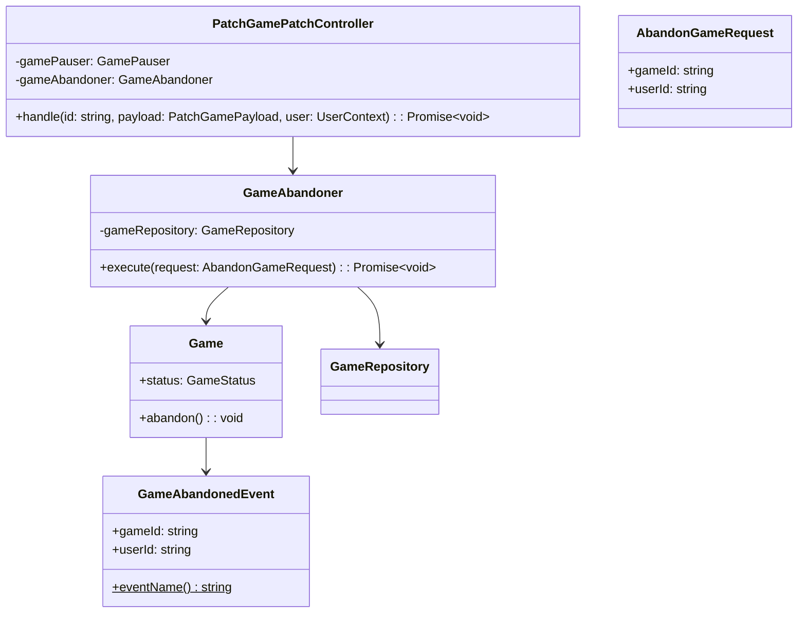

# Abandon Game — Diagrama de Clases

```mermaid
classDiagram
    class PatchGamePatchController {
        -gamePauser: GamePauser
        -gameAbandoner: GameAbandoner
        +handle(id: string, payload: PatchGamePayload, user: UserContext): Promise~void~
    }

    class GameAbandoner {
        -gameRepository: GameRepository
        +execute(request: AbandonGameRequest): Promise~void~
    }

    class AbandonGameRequest {
        +gameId: string
        +userId: string
    }

    class Game {
        +abandon(): void
        +status: GameStatus
    }

    class GameAbandonedEvent {
        +eventName()$ string
        +gameId: string
        +userId: string
    }

    PatchGamePatchController --> GameAbandoner
    GameAbandoner --> GameRepository
    GameAbandoner --> Game
    Game --> GameAbandonedEvent
```
