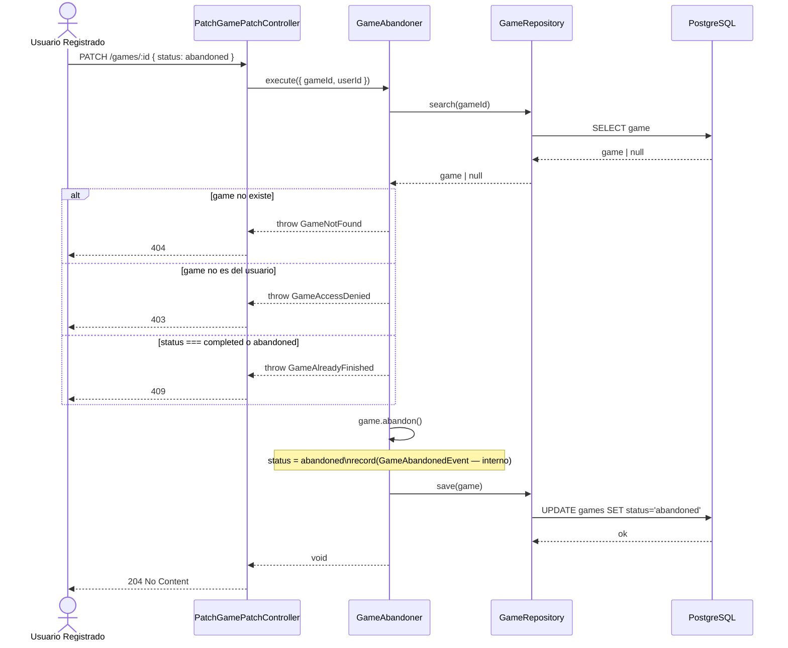

# Abandon Game — Diagrama de Secuencia

```mermaid
sequenceDiagram
    actor U as Usuario Registrado
    participant C as PatchGamePatchController
    participant UC as GameAbandoner
    participant GR as GameRepository
    participant DB as PostgreSQL

    U->>C: PATCH /games/:id { status: abandoned }
    C->>UC: execute({ gameId, userId })

    UC->>GR: search(gameId)
    GR->>DB: SELECT game
    DB-->>GR: game | null
    GR-->>UC: game | null

    alt game no existe
        UC-->>C: throw GameNotFound
        C-->>U: 404
    else game no es del usuario
        UC-->>C: throw GameAccessDenied
        C-->>U: 403
    else status === completed o abandoned
        UC-->>C: throw GameAlreadyFinished
        C-->>U: 409
    end

    UC->>UC: game.abandon()
    Note over UC: status = abandoned\nrecord(GameAbandonedEvent — interno)

    UC->>GR: save(game)
    GR->>DB: UPDATE games SET status='abandoned'
    DB-->>GR: ok

    UC-->>C: void
    C-->>U: 204 No Content
```
