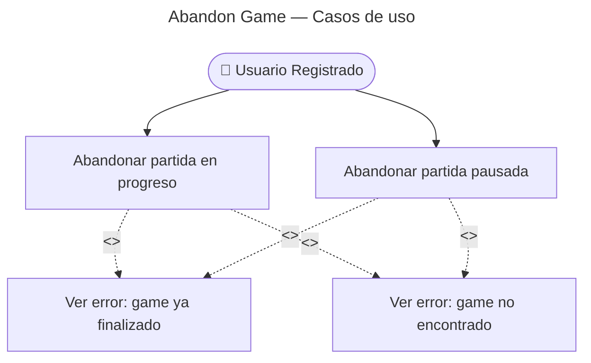

# Abandon Game — Casos de Uso

## Reglas de negocio

| Regla | Acción |
|---|---|
| Se puede abandonar desde `in_progress` o `paused` | Ambos estados son válidos |
| No se puede abandonar `completed` o `abandoned` | `GameAlreadyFinished` (409) |
| `GameAbandonedEvent` es INTERNO | No se publica al AMQP |
| Abandonar libera el slot de "juegos pausados" | Permite crear nuevos games si estaba en el límite de 5 |
| Solo usuarios registrados tienen este endpoint | Guest no puede pausar → tampoco tiene qué abandonar |
