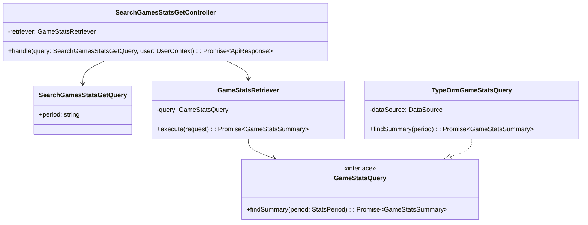

# Admin Game Stats — Diagrama de Clases

```mermaid
classDiagram
    class SearchGamesStatsGetController {
        -retriever: GameStatsRetriever
        +handle(query: SearchGamesStatsGetQuery, user: UserContext): Promise~ApiResponse~
    }

    class SearchGamesStatsGetQuery {
        +period: string
    }

    class GameStatsRetriever {
        -query: GameStatsQuery
        +execute(request): Promise~GameStatsSummary~
    }

    class GameStatsQuery {
        <<interface>>
        +findSummary(period: StatsPeriod): Promise~GameStatsSummary~
    }

    class TypeOrmGameStatsQuery {
        -dataSource: DataSource
        +findSummary(period): Promise~GameStatsSummary~
    }

    SearchGamesStatsGetController --> GameStatsRetriever
    SearchGamesStatsGetController --> SearchGamesStatsGetQuery
    GameStatsRetriever --> GameStatsQuery
    TypeOrmGameStatsQuery ..|> GameStatsQuery
```
